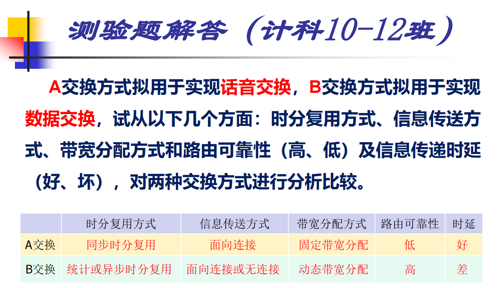
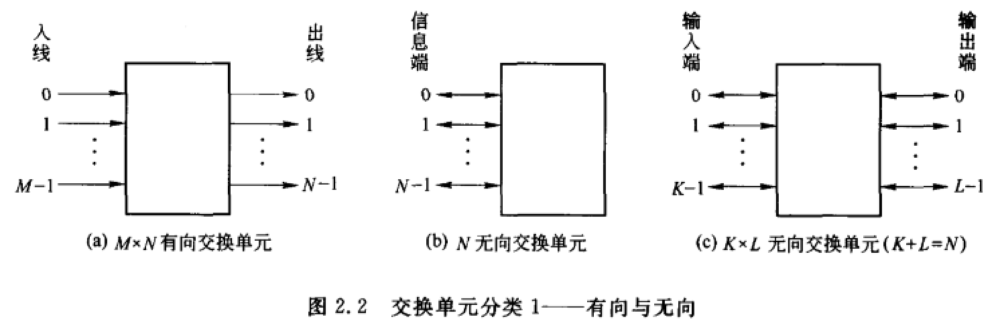
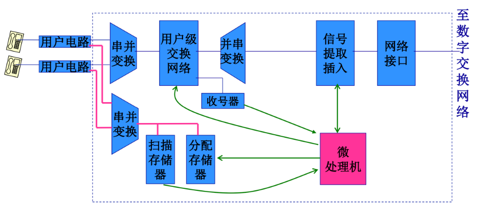
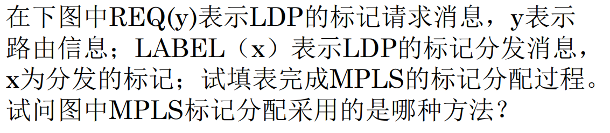
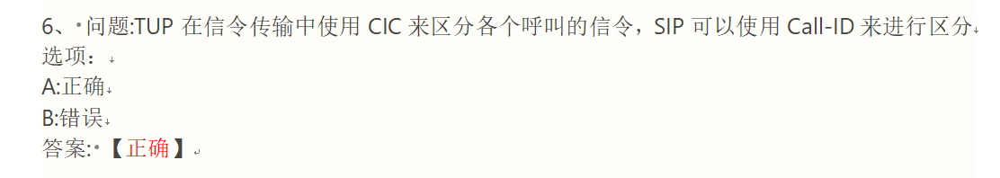
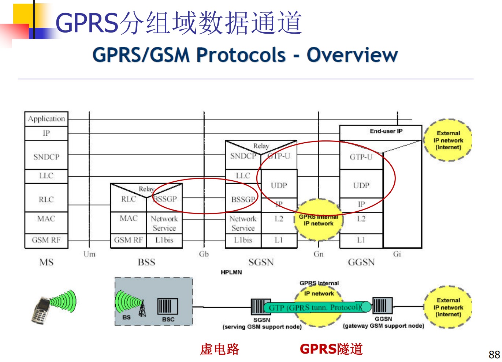
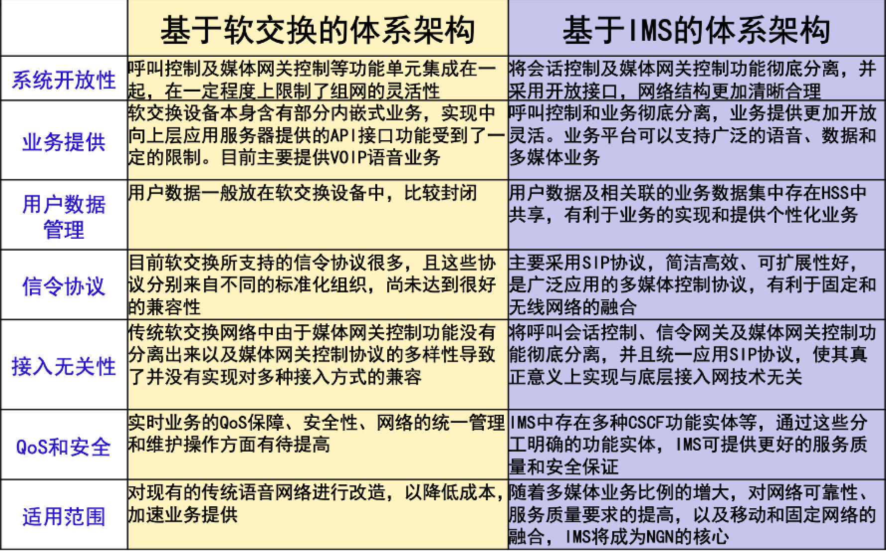

# 现代交换原理

# 第一章 交换概论

## 交换的概念

在通信网上，负责在通信源点和目的点之间建立通信通道，并传送通信信息的机制。

## 通信网

### 三要素

- **交换设备：**包括各类交换机和交叉连接设备。
- **传输设备：**包括用户线路、中继线路、信号转换设备。（如：双绞线、电缆、光缆、基站无线收发设备、光电转换器、卫星、微波等）
- **终端设备：**包括电话机、智能终端、智能外设等用户终端设备。

### 三对基本概念（详细解释见后面）

#### 信息传送

- 面向连接的工作方式（物理连接、逻辑连接）
- 无连接的工作方式

#### 时分复用

- 同步时分复用
- 统计（异步）时分复用

#### 带宽分配

- 固定带宽分配
- 动态带宽分配

### 通信网分层结构

传送层（用户接入网、核心网）、业务层、应用层

### 支撑网

**信令网：**通信网的“神经系统”；（No.7信令网）

**数字同步网**：保证网络中的交换和传输等设备的时钟同步；

**电信管理网（TMN）：**完成电信网和电信业务的性能管理、配置管理、故障管理、计费管理、安全管理（FCAPS)等

## 交换方式的特点

### 电路交换

电话通信中信息的传送方式：**公共交换电话网（Public Switched Telephone Network，PSTN）**，每一路能提供 64k 速率。

三个阶段：连接建立、信息传送、连接释放。**“三个阶段”是面向连接方式最显著的特征。**

#### 电路交换的特点

- 信息传送的**最小单位**是**时隙**：每个时隙采样 8bit，采样率 8kHz，每路通信速率 64kbps。
- 面向连接的工作方式（物理连接）：连接建立、信息传送、连接拆除。
- 同步时分复用（固定带宽分配）：时间划分为帧，帧划分为时隙。
- 无差错控制机制（实时性强）。
- 对通信信息不作处理（透明传输）。
- 流量控制基于呼叫损失制。

适合**实时性、恒定速率**的话音业务。

### 分组交换

机制：存储转发

#### 分组交换的特点

- 信息传送的**最小单位**是**分组**：由分组头、用户信息构成，分组头含有选路和控制信息。
- 面向连接（虚电路）方式和无连接（数据报）方式。
- 统计时分复用，动态分配带宽。
- 有差错控制机制：CRC 校验、重发等（设于第二层和第三层协议中）。
- 信息传送不具有透明性：对通信信息作处理，如拆分、重组等。
- 流量控制基于呼叫延迟制。

适用于**可靠性要求高、可变速率**的数据业务。

#### 虚电路与数据报比较

|            | 虚电路             | 数据报                 |
| :--------- | :----------------- | :--------------------- |
| 分组头     | 简单（逻辑信道号） | 复杂（详细的选路信息） |
| 选路       | 虚连接表           | 每个分组独立选路       |
| 分组顺序   | 有序               | 可能失序               |
| 故障敏感性 | 敏感               | 可靠性高               |
| 应用       | 连续数据流         | 询问/响应              |

### ATM交换

#### ATM交换特点

- 以分组传送模式为基础，并融合了电路传送模式高速化的优点
  - 固定长度的信元
  - 面向连接的工作方式（VPC/VCC）
  - 异步时分复用
  - 动态分配带宽
- 简化了分组通信中的协议，并由硬件对简化的协议进行处理，交换节点不再对信息进行流量控制和差错控制，**极大提高了网络传输处理能力**。

#### MLPS交换特点

见第四章

面向连接（LABEL）、多协议、标签交换

### 各类交换方式的基本信息交换单元及长度

| 交换类型  | 基本信息交换单元 | 可变/固定 |
| :-------- | :--------------- | :-------- |
| 电路交换  | 时隙             | 固定      |
| 报文交换  | 报文             | 可变      |
| 分组交换  | 分组             | 可变      |
| 帧中继    | 帧               | 可变      |
| ATM 交换  | 信元             | 固定      |
| MPLS 交换 | 标记分组         | 可变      |

## 时分复用技术

### 同步时分复用

- 用于电路交换。
- 采用位置化信道：
  - 根据数字信号在**时间轴**上的位置区别各路。无信息传送时，也会占用信道。
  - 每帧定长。
  - 信号经过复用器和分路器的时延**低**（1~2 帧）。

### 统计时分复用

又分为分组化时分复用、异步时分复用。

- 用于分组交换、ATM 交换。
- 采用标志化信道：使用分组头的标志区分各路通信。

#### 分组化时分复用

- 每个分组前附加标志码，标识分组的输出端或传送路径，与时间无关。
- 分组长度可变、分组头定界。
- 统计复用提高信道利用率。具有一定容量的排队存贮器，解决瞬间的出线冲突。
- 传输时延较小且稳定、处理时延与分组大小有关、排队时延与突发流量有关。

#### 异步时分复用

- 位置固定的标志化信道。
- 信元长度固定、插入空信元保持同步。
- 时延较为稳定。

## 信息传送技术

### 面向连接/无连接

面向连接：

- 无论物理或逻辑连接，通信分为三阶段：**连接建立、传送信息、连接拆除**。
- 连接建立后，传送的所有信息均沿此路径传送，保证信息有序性。
- 信息传送的时延（比无连接）小。
- 对网络故障敏感。

无连接：

- 没有连接建立过程，边选路边传送。
- 同一通信的信息到达目的地的路径无法预知，不保证信息有序性。
- 信息传送的时延（比面向连接）大。
- 对网络故障不敏感。

### 物理连接/逻辑连接（虚电路）

同：都具有连接建立、传送信息、连接拆除三阶段。

异：物理连接建立一条通信源和目的之间的物理连接通路；逻辑连接没有物理连接，通过在通信连接上的所有交换节点保存选路结果和路由连接关系实现逻辑上的连接。

## 带宽分配技术

### 固定带宽分配

### 动态带宽分配

## 交换技术的种类和特点（续）

## 各种常用网络的交换方式

|   网络   |        交换方式         |
| :------: | :---------------------: |
|   PSTN   |          电路           |
| Internet |          分组           |
|  B-ISDN  |          分组           |
|   NO7    |          电路           |
|   GSM    |          电路           |
|   GPRS   |       电路 & 分组       |
|    3G    | 先电路 & 分组，后纯分组 |
|  4G 5G   |          分组           |
|   MPLS   |      带标记的分组       |
|   SDN    |          分组           |

## 各种常用网络的重要信令/协议

| 网络     | 信令/协议 |
| :------- | :-------- |
| PSTN     | No.7      |
| MPLS     | LDP、SIP  |
| Internet | IP        |
| SDN      | Openflow  |

## 交换系统的基本构成

由**信息传送子系统（话路子系统）**和**控制子系统**组成。

TODO PSTN、MPLS网络、IMS、SDN（No7信令网、LDP、SIP、Openflow）

- 信息传送子系统（话路子系统）：
  - 交换网络：完成交换，实现任意出线与入线的互联。
  - 各种接口：分为用户接口和中继接口，用途是进行信号转换。
- 控制子系统：由处理机系统构成，是交换系统的“指挥中心”。

**例题**

# 第二章 交换网络

本章作业参考https://www.docin.com/p-831096853.html

## 连接概念

交换网络是由若干个交换单元按照一定的拓扑结构和控制方式构成的网络。交换网络的**三个基本要素**是：**交换单元**、不同交换单元间的**拓扑连接**和**控制方式**。交换单元是构成交换网络的最基本的部件。

交换单元的基本功能是在入线和出线之间建立一定的链接，是信息能从入线交换到出线。连接特性反映交换单元的连接能力。

### 连接、连接方式

连接

- 集合描述法：所有入线序号为集合$T$，出线序号为集合$R$。连接$c = \{t,R_t\}, t \in T , R_t \subset R$
- 函数描述法：$f(t)=R_t,\space R_t \subset R$
- 排列表达式：$\begin{pmatrix}
  t_1 && t_2 && \cdots && t_n \\
  r_1 && r_2 && \cdots && r_n \\
  \end{pmatrix}$
- 入线排列表达式$(0,1,2...,N-2,N-1)$
- 图形表示法：略
- 二进制函数表示：$E(x_{n-1}x_{n-2}...x_1x_0)=x_{n-1}x_{n-2}...x_1\bar{x_0}$，表示点到点二进制编号。

一个$N \times N$的交换单元最多可以有$N!$种不同的点到点连接方式。

连接方式

### 点对点、同发、广播

对于连接$c = \{t,R_t\}, (t \in T , R_t \subset R)$

- 如果$R_t$只有唯一元素，为点到点连接。

- 如果$R_t$包含多个元素，为点到多点连接。
  - 如果$R_t \ne R$，为同发。
  - 如果$R_t = R$，为广播。

例题

## 交换单元的结构、特性、工作原理

基本交换单元的结构、特性（需要的单元个数、是否内部阻塞、同发和广播能力）

### 交换单元的分类

- 按入线和出线信息传送方向： 

- 按入线和出线的数量关系 

- 按入出线之间是否共享单一通路

- 按交换单元所接收的信号

  - 数字交换单元

  - 模拟交换单元

**例题**

### 基本交换单元与开关阵列

- M×N有向  

- 采用矩阵表示开关通断：

  $$
  \begin{pmatrix}
  1 && 0 && \cdots && 0 \\
  0 && 0 && \cdots && 1 \\
  \vdots && \vdots && \ddots && \vdots \\
  0 && 1 && \cdots && 0
  \end{pmatrix}
  $$

  **不允许出线冲突时，同 column 只允许一个 1 出现；不允许同发广播时，同 row 只允许一个 1 出现。**

- N无向

  特点是主对角线不连通。需要$N(N-1)/2$个双向开关，或者$N(N-1)$个单向开关。

  

- M×N无向

  需要$M \times N$个双向开关，或者$2 \times M \times N$个单向开关。

  

#### 开关阵列性质

- 空分交换。
- 容易实现同发和广播。
- 信息从入线到出线具有均匀的单位延迟时间：信息从任一入线到任一出线经过的开关数是相等的，不存在时延抖动。
- 开关阵列的控制简单。
- 适用于构成较小规模的交换单元。
- 开关阵列的性能取决于所用的开关性能。（继电器、模拟电子开关、数字电子开关）

实际实现：

- 可用多路选择器。
- 可用 2\*2 交叉连接单元（crossbar）：可以避免出线冲突，但不支持同发。

### S 接线器

S 和 T 接线器仅用于 PCM（数字）交换。

- 构成：
  - 交叉点矩阵（开关阵列）。
  - 一组控制存储器（CM，Control Memory）。
- 功能：输入输出线之间的空间交换。

- 规格：
  - 一个 S 接线器所含控制存储器 CM 的数量=入（出）线数。（输入控制 CM 数=入线数，反之）
  - 每个控制存储器 CM 含有的存储单元个数=时隙数。
  - 每个存储单元中存储索引存储单元的地址，为 m 位 bit，且满足$N \le 2^m$，其中 N 为接线器的入（出）线数。
- CM 具有输入控制方式与输出控制方式：
  - **输入控制：控制一条输入线与每一条输出线的交叉点的开启与闭合，存储单元的内容表示对应输入复用线与哪一个输出复用线的交叉点开关在该存储单元所对应的时隙内接通**（对于入线$a$，在当前时隙$TS_i$，从$CM_a$的$i$号存储单元读出需要交换到的出线$b$，打开输入线$a$与$b$相交叉的开关，完成空间交换）
  - **输出控制：控制一条输出线与每一条输入线的交叉点的开启与闭合，存储单元的内容表示对应输出复用线上哪个交叉点在该存储单元所对应的时隙内接通**（对于出线$b$，在当前时隙$TS_i$，从$CM_a$的$i$号存储单元读出接受输入的入线$a$，打开输入线$a$与$b$相交叉的开关，完成空间交换）

特性：

- 只完成空间交换，不进行时隙交换。
- 空间接线器按时分方式工作。
- 输**出**控制方式易于实现多播（将多个 CM 的$TS_i$的存储单元置为同一条输入线即可）。
- 输出控制方式可自动避免出线冲突。

**例题**

### T 接线器

时分交换单元一般分为：共享存储器型交换单元、共享总线型交换单元。

- 共享存储器型：共 2N 个出入线缓存。入线缓存控制读出、出线缓存控制写入。

- 共享总线型：总线按照时隙轮流分配给入线控制部件和出线控制部件使用。
  - $kNV=B/T$（N 为入线数、V 为入线速率、B 为每时隙传送比特数、T 为时隙长度，k 为时隙分配因子）

时间接线器的构成：

- T 接线器
  - 话音存储器（SM，Speech Memory）：暂存话音的数字编码信息。
    - 存储单元个数等于 PCM 线路每帧时隙数；每单元至少 8bit（一路话音）。
  - 控制存储器（CM，Control Memory）：
    - 存储单元个数等于 SM；每单元至少$log_2n（n 为时隙数）$比特。

时间接线器输出控制方式：顺序写入、控制读出。

- SM：前半周期顺序写入话音、后半周期从地址读出话音

- CM：前半周期顺序写入控制地址、后半周期控制读出话音。

  缺点：复用级别越高，对控制电路要求越高，无法达成很大规模；时隙转换延迟不定。

时间接线器输入控制方式：控制写入、顺序读出。

特性：

- 时分交换，用于交换同步时分复用的信号。
- SM 划分为N个区域，每个区域一个字节，存放一个话音数据。各个区域间不共享，无排队缓冲。
- 交换的控制过程由 CM 硬件实现，速度快。
- 交换时延小且稳定。
- 严格无阻塞，并且可避免出线冲突。
- 易于实现同发和广播。
- 速率固定。

**例题**

## 无阻塞网络概念

**严格无阻**：只要需要交换的入线与出线空闲，就可以通过交换网络建立一个连接。

**可重排无阻**：只要需要交换的入线与出线空闲，就可以通过交换网络直接地或对已有连接进行重排之后建立一个连接。

**广义无阻：**存在一种精巧的选路方法，使得只要需要交换的入线与出线空闲，**不必重排**，就可以通过交换网络建立连接。

## 交换网络的分类与特性

- 单级网络、多级网络：需要交换的信息从交换网络入线到出线经过 n 个交换单元，并且同一级中不同交换单元的入线和出线之间可以建立连接（交换单元需要发挥交换作用而非直连），则称为 n 级交换网络。
- 有阻塞网络、无阻塞网络：见上一小节。
- 单通道网络、多通道网络：任一条入线和出线之间只存在唯一的一条通路，则为单通道网络。
- 出线竞争：不同入端来的信息同时争抢交换网络同一个输出端口而发生的竞争。
- 内部竞争：同时要交换的两路信息同抢交换单元内部的通路资源。

### CLOS 网络：严格无阻、可重排无阻公式和构造

3 级 CLOS 严格无阻：$m \ge 2n-1$

3 级 CLOS 可重排无阻：$m \ge n$

构造法：根据要求确定中间级个数$m$，一三级分别采用$n \times m$和$m \times n$交换单元，$r=N \div n$（一三级单元个数），中间级采用$r \times r$交换单元。

**例题**

出线入线数目 n=8，要构造严格无阻塞 CLOS 网络，则要求m≥2n–1=15

### TST：结构、SM 和 CM 容量和内容、反向半帧、同发特性

详见第三章，因为可以考的太多了，这里放不下，真得看吧。

内部阻塞：存在，但概率很小，约为$10^{-6}$。

TST网络完全无阻塞的条件：m（内部时隙数）=2n（输入时隙数）

同发特性：

- 初 T 顺入控出， S 输出控制/输入控制， 次 T 控入顺出。
- 初 T 控入顺出， S 输出控制/输入控制， 次 T 顺入控出。

**例题**

 

### BANYAN 网络

特性：单通路、有阻塞（内部竞争）、基于树形结构所以能自选路由。

构造法：构造$N \times N$的 BANYAN 网络，需要$log_2N$级，每级$N/2$个交换单元，共$(N/2)×log_2N$个交换单元。拿两个$n \times n$网络，将$n$个$2\times 2$交换单元作为一级通过混洗连接到前部、或者通过反转混洗连接到尾部。

降低阻塞方法：

- 增加网络级数（如 BENES 网络），每增加一级，通路数翻倍。但同时失去唯一路径和自选路特性。
- 使用扩展型或膨胀型 BANYAN 网络。
- BATCHER-BANYAN（排序-BANYAN）网络：严格无阻塞、结构规整、自动选路。
- 减少入线的信息量，加大入线缓存。
- 增加平面数，构造多通道交换网络。（几平面就是几倍的交换单元）

### BENES 网络

两个 BANYAN 网络背靠背连接，并将中间两级合并为一级。是**可重排无阻塞网络**，**多通路**。 构造法：$N×N$的 BENES 网络需要$(N/2)×(2×log_2N−1)$个2×2交叉单元。

**例题**

用2×2交换单元构成16×16的 BANYAN 网络和 BENES 网络，比较二者异同

相关性：BENES 网络是两个 BANYAN 网络背靠背连接，并将中间两级合并为一级。

# 第三章 电路交换（话音交换）

本章作业参考自https://max.book118.com/html/2019/0302/6210145231002012.shtm

## 程控数字交换机的结构

### 用户模块——远端用户模块/母局模块

### 程控交换机的接口类型

例题

## 模拟用户电路、数字中继电路的基本功能

这里先讲用户模块，再到用户模块中的用户电路，再讲数字中继电路。

### 用户模块

- 用户电路：每条用户线有一个用户电路，完成信号采集、动作驱动、话音传输等功能。
- 交换电路：用户级交换和话务集中（集中比为 2：1 或 4：1）。
- 收号器：接收用户的 DTMF 号码。
- 扫描存储器：接收各个用户电路的扫描信息，送用户处理机。
- 分配存储器：接收用户处理机对各个用户电路的指令，控制各用户电路继电器的动作。
- 用户处理机：与中央处理机协调控制用户电路和交换电路的工作。
- 通信电路（信号提取插入）：负责收发用户处理机与中央处理机之间通信的信息。
- 网络接口：负责把用户的话音和处理机来的消息合并在一起，送到中央级的数字交换网络。

### 模拟用户电路功能：BORSCHT——举例，用户电路板

**博BO人R四S川C何H同T**：

- 馈电（Battery feeding）：向用户提供直流馈电电流，电压**-48V**。
- 过压保护（Overvoltage protection）：二极管用于钳制电压，无论外线电压高于或低于内线，都会由二极管钳制内线为-48V，R 为热敏电阻，可自行烧毁。
- 振铃控制（Ring control）：控制是否向用户线发送 25Hz 铃流信号。
- 监视（Supervision）：监视用户环路的通断状态，通过电阻的直流压降得知用户是否**摘机**。
- 编译码和滤波（CODEC&filters）：模拟话音信号与 64Kbps 数字话音信号转换。对模拟信号进行编码、对数字信号进行解码；为避免混叠失真、50Hz 干扰、3400Hz 以上频率分量，进行滤波。**编码器完成模拟信号到数字信号的转换；译码器完成数字信号到模拟信号的转换。**
- 混合电路（Hybrid circuit）：在用户话机的 2 线双向信号和 PCM 的 4 线单向信号之间进行 2/4 转换。（发生在编码之前和译码之后）
- 测试（Test）：控制是否进行内外线的故障检测。

### 数字中继电路（用于与数字交换局或远端模块的连接）

- **码型变换：**内部 NRZ 码（单极性不归零码）与外部 HDB3 码（高密度双极性码）之间的转换
- **帧同步**：就是从接收的数据流中搜索并识别到同步码，以确定一帧的开始，以便接收端的帧结构排列和发送端的完全一致。**是复帧同步的基础**
- **复帧同步**：如果数字中继线上使用的是随路信号（中国1号信令），则除了帧同步外，还要有复帧同步。复帧同步是为了解决各路标志信号的错路问题。
- **时钟提取：**就是从输入的数据流中提取时钟信号，作为输入数据流的基准时钟。同时该时钟信号还用来作为本端系统时钟的外部参考时钟源。
- **提取和插入随路信号：**
- **帧定位（再定时）：**

## 数字交换网络

### 复用器与分路器

1 点速率为 2048 kbit/s，传输信号为串行码；2 点速率为 256 kbit/s，传输信号为 8 位并行码；3 点速率为 1024 kbit/s，传输信号为 8 位并行码。

### T 接线器，串并复用与分路并串的时隙换算

- 如果复用器输入线数为n，依次编号为0,1,…,n−1，且i号输入线上j时隙信号$TS_j$经复用器串并变换和复用后，在输出线上第k个时隙输出，即在$TS_k$出现，则有：$k=j *n+i$。

### 话路建立（简单版）

- 用户 A 呼叫用户 B：用户级出线$HW_0TS_{8}$经过复用器$M_0$交换为$ITS_{16=2*8+0}$（因为这里n = 2,  j = 8 , i =0），选择交换时隙$ITS_{20}$；
- 用户 B 建立到用户 A 的连接：采用反向法（半帧法）计算，由$ITS_{20}$，T 接线器输入信号每帧为 64 时隙（由两条 PCM32 线路复用而来），半帧为 32，故 20+32=52，所以 B 到 A 的连接选择$ITS_{52}$。

### 话路建立（完整版）

- 每个用户模块连接**256**个用户，内部提供**8**条**HW**，**32TS/HW**(即**256\*256**)的交换

- 所有模块(包括用户模块**/**中继模块**/**信号音源)连接到**TST**的中央交换网络，支持**16K\*16K**的交换(每个**T**支持**512\*512** 交换)。用户模块采用复接方式接入**TST(A**为复接点**)**，实现话务集中

- 用户**A**接至模块**0**的**HW0TS1**，用户**B**接至模块**n**的**HW7TS31** (双向都使用该时隙)

- 系统为用户**A**选择模块**0**的空闲时隙**HW0TS3**(双向)，模块**0**的**HW0**固定连接到**M0**的**HW0**;为用户**B**选择模块**n** 的空闲时隙**HW3TS8**(双向)，模块**n**的**HW3**固定连接到**M31**的 **HW8**

- **A**→**B**连接时，**TST**网络选择使用内部时隙**ITS4**；**B**→**A**连接时， 使用反相法选择内部时隙

### 会议电话的实现

## 控制部分

控制方式：

- 集中控制：处理机对交换系统内所有功能及资源统一控制。
  - 处理机直接控制所有功能的完成和资源的使用，因此控制关系简单，处理机间通信接口简单。
  - 单个处理机上的应用软件复杂、庞大。
  - 一旦处理机系统故障，整个控制系统失效。可靠性较低。
- 分级分散控制：控制系统由多个处理机构成，分别完成不同功能并对不同资源实施控制。
  - 处理机之间分等级，高级别处理机控制低级别处理机。
  - 处理机之间通信接口较为集中，控制方式复杂，但比全分散简单。
  - 各处理机上应用软件复杂程度适中。
  - 控制系统的可靠性适中。
- 全分散控制：各个处理机之间独立工作，分别完成不同功能并对不同资源实施控制。
  - 处理机之间不分等级，不存在控制与被控制关系。
  - 每台处理机只完成部分功能，要求各处理机协调配合完成整个系统功能，通信接口复杂。
  - 每台处理机应用软件只完成该处理机承担的功能，较为简单。
  - 可靠性较高。
  - 系统具有良好的扩充能力。

## 多处理机之间的工作方式

程控交换机控制系统的多处理机之间的工作方式主要有三种：功能分担方式、话务分担方式和冗余方式。

- 功能分担

  - 多个处理机分别完成同一话务的不同功能。
  - 提高整个系统的适应性，完成不同功能的处理机可以有不同的配置。

- 负荷分担（话务分担）

  - 多个处理机各自完成一部分话务功能。
  - 提高BHCA，提高可靠性。

- 冗余

  - 双机冗余配置：两套处理机系统，一个主用、一个备用。

    - 同步方式：主备用机同步工作，同时执行指令并比较结果。
    - 互助方式：主备用机负荷均分，分别承担一半话务负荷。一台机器故障，负荷全部转移到另一台机器上。
    - 主备用方式：主机在线运行，备用机处于待机状态。（冷备用：不保存动态呼叫数据，故障切换时直接呼损。热备用：保存动态呼叫数据，故障切换时不会呼损。一般采用热备用。）

  - N+m 冗余配置：N 个处理机在线运行，m 个处理机处于备用状态。

## 程控数字交换机软件

特点：**实时性、多任务并发执行、高可靠性**

### 扩展有限状态机&SDL 

#### 拓展有限状态机

#### SDL

### 呼叫处理原理

#### 呼叫处理过程

- 输入处理——对用户线、中继线、信令设备进行监视和信号识别，生成相应事件放入队列，供其它程序取用，大多属于**周期级程序**。重点掌握**摘挂机检测**
- 分析处理——输入处理得到的各种事件，交分析处理程序分析，以决定下一步的工作。它没有固定周期，属于**基本级程序**。
  - 去话分析：基于**主叫用户数据**
  - 号码分析：基于**用户拨号号码（用户线、中继线）**，一般包含**号首分析**、**号码翻译**。
  - 来话分析：基于**被叫用户数据**，一般有**呼叫等待、遇忙呼叫转移、遇忙回叫、计费类别**。
  - 状态分析：状态分析的信息源是**状态和输入事件**

- 输出处理——
  - 启动和停止各种**计时器**
  - 分配和释放各种**资源**（DTMF收号器、时隙）
  - 形成信令、处理机间通信消息和驱动硬件的控制命令
  - 开始和停止计费、计算操作、存储各种号码
  - 对用户数据、局数据的读写操作
  - 驱动交换网络**建立或拆除话路**
  - 送/停各种信号音、振铃和停振铃
  - 连接DTMF收号器
  - 发送公共信道信令、发送处理机间通信信息等

例题

#### 本局呼叫处理

例题

TODO

**摘挂机检测（重点）**

### 任务分级和调度

#### 任务分级

- 级间转移的原则：级别高的程序优先处理。

| 程序级别 | 程序功能                       | 启动方式 | 响应速度         |
| -------- | ------------------------------ | -------- | ---------------- |
| 故障级   | 故障识别和紧急处理             | 硬件中断 | 立即响应         |
| 周期级   | 按一定周期进行的各种扫描和驱动 | 时钟中断 | 在严格时限内相应 |
| 基本级   | 分析处理和各种无时限任务       | 事件队列 | 在一定时限内相应 |

#### 时间表调度算法

- 每次时间中断到来时，对时间计数器加一，根据时间计数器的值形成时间表行地址。屏蔽表用于控制在该时刻程序是否被调用执行。

时间表的每一行代表时间，每一列为一个比特，代表一个程序。若在第 i 行第 j 列的比特位的值为“1”, 则表示在这个时刻该程序被调用；若为“0”则不被调用。每次时间中断到来时，都要对时间计数器做加“1”操作，时间计数器的值形成了时间表的行地址。程序地址表保存被调用程序的入口地址。屏蔽表用于控制在该时刻该程序是否被调用执行，屏蔽表的每一位对应一个程序，如果某一位为“1”则表示该程序可执行，否则不执行。屏蔽表提供了一种灵活控制程序调用的机制，不用频繁更改时间表了。若时间中断周期为 10ms，则由上述表格结构的设计可知：

- 拨号脉冲识别程序每隔 10ms 被调用执行。
- 按键号码识别程序每隔 20ms 被调用执行。
- 位间隔识别程序每隔 100ms 被调用执行。
- 用户线扫描程序每隔 100ms 被调用执行。
- 中继线扫描程序每隔 100ms 被调用执行。

**例题**

### BHCA 计算

BHCA（maximum number of Busy Hour Call Attempts，最大忙时试呼次数）

- 处理机的系统开销=固有开销（与呼叫处理次数无关）+非固有开销（与呼叫处理次数有关）
- BHCA 计算：$t=a+bN$，t 为总开销时间，a 为固有开销，b 为处理一次呼叫的平均非固有开销，N 为单位时间内处理呼叫总次数。注意单位是小时。

例题

### 过负荷状态

如果在一个有效的时间间隔周期内（不包含峰值瞬间），出现在交换设备上的试呼次数，即话务负荷超过了交换机控制系统的设计处理能力时，则称该交换设备运行在**过负荷状态**。

加入到交换设备上的总负荷中，超过它的设计负荷能力部分称为过负荷部分，一般用负荷的百分数来表示。如加入到交换设备上试呼总次数超过它的设计负荷能力的10％时，此时称10％过负荷。

### 过负荷控制

对交换机过负荷控制的要求是：当出现在交换设备上的试呼次数超过它的设计负荷能力的50％时，**允许交换设备呼叫处理能力下降至设计负荷能力的90％**

# 第四章 分组交换

## 综合业务数字网ISDN

端到端全数字连接；提供多种业务；统一的多用途接口

## 路由器的交换结构

**路由部件（JUNOS）**

- Internet 软件包，包括丰富的路由协议组件（OSPF、BGP4、 IS-IS 等）。
- 根据路由协议更新路由表

**路由查找部件（Packet Process）**

- 处理机级的 ASIC，与 JUNOS 软件相结合，使 M40 系统达到线速交换的水平。
- 高速查找：最长匹配查找速度为每秒 40M 个路由，可支持 8*OC - 48 系统的线速路由查找。
- 可编程：支持 IPv4、 MPLS、IPv6 和帧中继等多种协议。
- 转发表自动更新： Routing Table 中的路由表更新后，自动刷新 Forwarding Table 的路由数据。

**线路卡（Line Card）**

- 支持 SONET/SDH、ATM 和 DS3 等类接口 。

**交换单元（Switch Fabric）**

- 40Gbps 的交换单元
- 以共享存贮器为核心，配以适当的缓冲管理 ASIC 和 I/O 管理 ASIC，将每一个包分解成 64 字节的“块” （block）作为存贮、交换的基本单位
- 通过“包通告”（Notification）进行交换控制。

## ATM基本原理

### 信元结构

信元由5字节信头和48字节信息段（净荷）组成，一共**53bytes**：

- GFC（Generic Flow Control）：一般流量控制字段（4个比特），用于接入的流量控制。由于B-ISDN的UNI接入的终端数量可以很多，需要控制流向网络的流量，以避免网络，短期过载。
- VPI/VCI（Virtual Path Identifier/Virtual Channel Identifier）：选路信息
- PT（Payload Type）：3个比特，表示净荷类型
- CLP（Cell Loss Priority）：表示信元丢失优先级，只有1个比特，CLP=0，表示高优先级；CLP=1,表示低优先级，若遇到拥塞要丢弃信元时，CLP=1的信元将首先丢弃。
- HEC（Head Error Control）：1个字节，用于信头差错控制ATM信元及其结构

### 异步时分复用技术

STD（Synchronous Time Division）：通过时间位置来区别每一个逻辑信道

ATD（Asynchronous Time Division）：通过标记来区别每一个逻辑信道

### 面向连接的工作方式——虚通道与虚信道

ATM传输通道可分割成若干个逻辑子信道，为便于应用和管理，逻辑子信道可按两个等级来划分：虚通道（VP--Virtual Path）虚信道（VC--Virtual Channel ）

### 比较

## MPLS概念

- MPLS—Multi-Protocol Label Switching，**标记、多协议**
  - **标记：**MPLS是一种有效的封装机制，通过在packets (IP packets,AAL5, frames)上使用标记“Labels”进行数据传递
  - **多协议：**不仅可以支持多种上层网络协议，包括IPv4、IPv6等，而且可以运行于不同底层(ATM、FR、PPP)的网络之上

- MPLS 在多种第二层协议上进行标记交换，将第二层和第三层有机结合。
- 核心思想：**边缘路由，核心交换**：边缘路由保持与现有协议兼容，增强核心网络交换速度。

## MPLS标记

### 基本标记格式

一共**32bits，4字节**，如图所示。并且**支持多层标记**

### 标记封装

## MPLS网络构成

- **边缘路由器LER**： Label Edge Router 根据 FEC 查询 LIB 得到下一跳 Label，将 Label 插入 IP 包头，从相应端口发送。
- **入口LER Ingress LER**： Ingress Label Edge Router 入口边缘路由器，为每个 FEC 生成 Label，映射到 LSP 下一跳的标记。对入口 IP 分组进行分类，确定 FEC。
- **出口LER Egress LER** ：去掉 Label ，还原成普通 IP 包，查找路由表将IP包继续转发。
- **核心路由器 LSR**： Label Switch Router，维护 LIB、完成标记置换。
- **标记交换路径 LSP**： Label Switched Path 标记交换路径，类似虚电路。
- **标记分发协议 LDP**： Label Distribution Protocol MPLS的控制协议，用于LSR之间交换信息，完成LSP的建立、维护和拆除等功能。**MPLS同时也采用计时器方式进行标记的拆除**
- **转发等价类 FEC**： Forward Equivalence Class 转发等价类。FEC的划分通常依据网络层的目的地址前缀或是主机地址，相同 FEC 的包具有相同 Label，走相同 LSP。
- **标记信息库 LIB**： Label Information Base 标记信息库，保存转发 Labeled 分组所需要的信息。

## MPLS交换特点

面向连接、支持多协议、标签交换

- 标记置换：将 2 层的交换速度带到 3 层
- 控制平面与转发平面分离：便于采用新的路由协议和交换技术
- 通过标记堆栈实现多层次的转发：提高可扩展性

**例题**

## MPLS交换原理

**LDP 标签分配过程：**

- 发现相邻的 LDP 对等体：使用 UDP 广播，发现相邻 LSR
- 建立 LDP 会话：相邻 LSR 建立 TCP 连接，建立 LDP 会话
- 建立 LSP：下游 LSR 分配标记并沿着 LDP 会话通知上游 LSR

**标记分配方式**

**标签操作：**

- **Push**：标签入栈，进入子路由域内传输。
- **Pop**：标签出栈，回到父路由域传输。
- **Replace**：置换标签，在同一路由域内传输。

**连接建立过程**

**例题1**

**例题2**

**例题3**

**例题4**

TODO

# 第五章 信令系统

> 看到这里记得回去看一下第一章的支撑网。

## 信令概念

信令是呼叫接续过程中所采用的一种**“通信语言”**，用于协调动作、控制呼叫。这种“通信语言”应该是可相互理解的、相互约定的、以达到协调动作为目的的。信令是通信网中**规范化**的**控制命令**，它是控制交换机产生动作的命令。

**按信令的功能分**

- 线路信令：具有监视功能，用来监视主被叫的摘、挂机状态及设备忙闲。
- 路由信令：具有选择功能，如主叫所拨的被叫号码，用来选择路由。
- 管理信令：具有操作功能，用于电话网的管理和维护。

**按信令的工作区域分**

- 用户信令：是用户和交换机之间的信令，在用户线上传送。主要包括用户向交换结点发送的监视信令（状态信令）和选路信令（地址信令），交换结点向用户发送的铃流和各种音信号（音信令）。**用户线信令少而简单，中继线信令多而复杂。**
- 局间信令：是交换结点之间的信令，在局间中继线上传送，用来控制呼叫的建立和释放。**比如NO7信令。**

**按信令的信道分**

- 随路信令：信令和话音在**同一条话路**中传送的信令方式。
- 公共信道信令：是以时分方式在一条高速数据链路上传送**一群话路**的信令的信令方式。**比如NO7信令。**

## 七号信令

### 七号信令网结构

国内信令点编码：**24bits**，主信令区、分信令区、信令点

| HSTP 高级信令转接点 | LSTP 低级信令转接点 | SP 信令点 |
| ------------------- | ------------------- | --------- |
| 8bit                | 8bit                | 8bit      |

国际信令点编码：**14bits**（大区和 SP 变为 3bit）

### 我国的信令网结构

HSTP 设在 C1、C2 交换中心，C1 和 C2 长途局直接与 HSTP 相连，HSTP 汇接 C1、C2 及所属 LSTP 的信令。LSTP 设在 C3 交换中心，同一分信令区内的长途局应与本区内的每对 LSTP 相连，LSTP 汇接 C3、C4、C5 信令点的信令。

### 七号信令协议栈结构

- MTP（Message Transfer Part）：消息传递部分（重点）
  - MTP1——物理层
  - MTP2——数据链路层
  - MTP3——网络层一部分
- SCCP：信令连接控制部分——网络层一部分
- UP（User Part）：用户部分——传输层、会话层、表示层、应用层
  - ISUP：综合业务数字网部分
  - TUP：电话用户部分（重点）
  - DUP：数据用户部分
  - TCAP：事务处理能力部分
    - INAP：智能网应用部分
    - OMAP：操作维护应用部分
    - MAP：移动通信应用部分

MTP 各级功能：

| OSI 对应     | MTP 部分             | 功能                                                         |
| ------------ | -------------------- | :----------------------------------------------------------- |
| 物理层       | MTP1：信令数据链路级 | 规定信令链路电气特性和接入方法。在采用数字传输通道时，速率 64Kbps。 |
| 数据链路层   | MTP2：信令链路功能级 | 将第一级中透明传输的比特流划分为不同长度的信令单元，有差错检测和重发校正。 |
| 一部分网络层 | MTP3：信令网功能级   | 保证信令单元在网络中的可靠传输。又分为信令消息处理和信令网管理两部分。 |

### 电话用户部分TUP

规定电话呼叫的建立和释放的信令流程，以及实现这些流程的消息和消息编码。并能支持部分用户补充业务。提供电话呼叫的控制信令，完成电话呼叫续接和控制。

- 处理 SIF 字段中的 CIC、H0H1、信令信息。

呼叫信令：

| 消息类型 | 含义                                   |
| -------- | -------------------------------------- |
| IAM      | 初始地址消息                           |
| ACM      | 地址全消息，表示被叫空闲，呼叫建立成功 |
| ANC      | 被叫应答、计费消息                     |
| CLF      | 前向释放                               |
| CBK      | 后向释放                               |
| RLG      | 正常呼叫结束时电路释放监护消息         |
|          |                                        |
| SLB      | 市话忙                                 |
| STB      | 长话忙                                 |
| CGC      | 电路群拥塞                             |
| SEC      | 交换机拥塞                             |

### 七号信令单元格式

三种信令单元：

- 消息信令单元 MSU（Message Signaling Unit）：运载高层（用户部分或信令网管理功能）产生的信令消息。

- 链路状态信令单元 LSSU（Link State Signaling Unit）：用来传送链路状态信息。

- 插入信令单元 FISU（Filled-In Signaling Unit）：在无 MSU 和 LSSU 时发送。

- MTP2 处理 F、CK、FSN、BSN、FIB、BIB、LI

- MTP3 处理路由标记和 SIO。MSU 信令的 SIF 信息字段中开始位置是路由标记（Routing Label），分为：

  - DPC：目的信令点编码
  - OPC：源信令点编码
  - SLS：信令链路选择码

  路由标记供 MTP3 级进行消息寻址和路由。国内的信令点编码 24bits，国际 14bits。

- 电话用户部分 TUP 处理 MSU 信令中 SIF 子段的 CIC、H0H1、信令信息：

  - **CIC 标记话路时隙**
  - H0H1 是标题码
  - 信令信息传递消息参数

例题

### 信令消息的传递

- 直联工作方式：SP 和 SP 之间的信令消息通过直接相连的信令链路传送。
- 准直联工作方式：SP 和 SP 之间的信令消息通过（STP 转发）预先指定的多条串接的信令链路传送。
- 非直连工作方式：不预先指定，随机转发（复杂，No.7 未采用）

准直联方式下信令信息的传递方式：

## SIP 信令

SIP（Session Initiation Protocol）会话发起协议是一种 IP 电话信令协议。

### 基本特点

- SIP是由IETF提出的、一种**C/S**（客户-服务器）结构的信令协议。
- **应用层**控制协议，独立于底层协议。用于建立、修改和中止 IP 网上的双方或多方多媒体会话。
- 基于**文本的消息编码**，使用 UTF-8 字符集，易于读取和调试。
- 具有多个层次的可实现性，最小的实现非常简单、最完全的实现能够完成非常多的功能。
- 通过代理、重定向功能支持用户的移动性。
- 可与 **RTP/RTCP、SDP**、RTSP、DNS 等协议配合。易于实现和扩展。
- SIP已被3GPP采纳为IMS的协议标准之一。

### SIP 系统中各网元（用户代理、代理服务器、注册服务器）作用

- 用户代理（User Agent）：终端用户设备，用于创建和管理 SIP 会话的设备。UA 发出消息，代理服务器对消息进行响应。
- 代理服务器：接收 UA 的会话请求并查询 SIP 注册服务器，获取收件方 UA 的地址信息。然后，根据收件方域的位置，将会话邀请转发给收件方 UA 或代理服务器。
- 注册服务器：包含域中所有用户代理的位置的数据库。在 SIP 通信中，注册服务器会检索参与方的 IP 地址和其它相关信息，并将其发送到代理服务器。

### SIP 相关协议

- SIP 呼叫准许与建立、SDP 媒体通道协商与建立：基于 TCP 或 UDP
- RTP 媒体流：基于 UDP

### SIP 请求

- 呼叫控制请求
  - INVITE 发起呼叫，并对会话进行描述
  - ACK 主叫确认收到被叫发送的对INVITE的确认响应
  - BYE 释放连接，可以由主叫方发出，也可以由被叫方发出
  - CANCEL 主叫取消呼叫，在连接建立起来之前发送
- 注册请求
  - REGISTER 在注册服务器上注册用户代理
- 能力查询请求
  - OPTIONS 查询服务器的能力

### SIP 消息

| 消息       | 功能                                                         |
| ---------- | ------------------------------------------------------------ |
| register   | 在注册服务器上注册用户代理 UA。                              |
| invite     | 发起呼叫，并对会话进行描述。                                 |
| 100trying  | 正在尝试连接。                                               |
| 180ringing | 正在振铃。                                                   |
| 200ok      | 请求成功。                                                   |
| ack        | 主叫确认收到被叫发送的对 invite 的确认响应。                 |
| bye        | 释放连接，主被叫双方都可以发出。                             |
|            |                                                              |
| 1xx        | 通知服务器或代理正在执行处理，终端应该等待响应。例如100：Trying、180：Ringing |
| 2xx        | 成功。例如200：OK                                            |
| 3xx        | 重定向响应，终端应向新地址发送请求。                         |
| 4xx        | 请求失败，被拒绝。                                           |
| 5xx        | 服务器内部错误造成不能响应。                                 |
| 6xx        | 全局错误，未来该用户所有请求都无法响应。                     |

SIP 地址与端口：`sip:username@company.com:5060`。

SDP 媒体协商的重点内容：SIP 消息体主要是 SDP 会话描述协议，用于描述这次回话的媒体信息。话音流使用 RTP/RTCP 传输。

通过 Call-ID 区分各个呼叫。

- 注册流程（失败与成功）：

- 基本呼叫建立：

- 正常呼叫释放：

- 被叫忙呼叫释放：

- 被叫无应答，主叫挂机：

- 被叫无应答，超时：

- 注销（将 register 里的 expires 字段置为 0）：

例题

### SIP 消息与TUP对应转换

# 第六章 移动交换

## 移动通信的基本概念

入网、鉴权、切换、漫游、位置更新、网络附着

| 概念     | 内容                                                         |
| -------- | ------------------------------------------------------------ |
| 入网     | GSM 中，MS 向 BSC 申请 SDCCH 或 TCH 信道进行通信的过程。GPRS 中，MS 向 SGSN 发送入网附着请求的过程。 |
| 鉴权     | MS 使用网络之前，网络检查其合法性的过程。                    |
| 切换     | 将一个正处于呼叫状态中的 MS 转换到新的业务信道上的过程。通常由 MS 位置移动或小区业务负载均衡触发。 |
| 漫游     | 用户当前位置非本号码的 HLR 服务区。‌**GSM中负责漫游控制的设备是MSC** |
| 位置更新 | MS 从一个位置区移动到另一个位置区，发现其存储器中的 LAI 位置区标识与接收到的 LAI 发生变化，便执行登记的过程。 |
| 网络附着 | MS 附着在 GPRS 网络上，MS 和 SGSN 中记录该用户的路由信息，建立对于该用户 IMSI 的**移动管理上下文**（PDP）——GTP隧道建立是在这个过程中完成的。 |

## GSM、GPRS 的基本网络结构及网元功能

### GSM 网络结构、网元功能

GSM采用**电路方式（固定带宽分配）**，提供9.6/14.4kbps的数据业务，但一个用户只能分配一个信道。

主要分为 MS、BSS、NSS、OMC 四大部分。

- MS（移动台）：移动客户设备部分，分手持机和车载台。包括移动终端（ME）、手机客户识别卡（SIM），注意SIM卡不存用户的手机号。

- BSS（无线基站子系统）：由 MSC 控制，是与 MS 通信的系统设备。主要完成无线发送接收和无线资源管理等功能。

  包括基站收发信机 BTS、基站控制器 BSC。

  - BTS（基站收发信机）：完成无线传输、无线与有线的转换、无线分集、无线信道加密。
  - BSC（基站控制器）：连接 BTS 与 MSC、为 BTS 和 OMC 的信息交换提供接口，具有控制一个或多个 BTS 的功能。完成无线网路资源的管理、呼叫和通信链路的建立与拆除、本控制区内 MS 越区切换的控制、小区配置数据管理、功率控制等。

- NSS（交换网路子系统）：完成交换功能、完成客户数据、移动性管理、安全性管理所需的数据库功能。

  包括 MSC、HLR、VLR、AUC、EIR。

  - MSC（移动交换中心）：蜂窝通信网络的核心，对位于本 MSC 控制区内的移动用户进行通信控制和管理。完成信道的管理和分配、呼叫的处理和控制、用户位置信息的登记与管理、越区切换和漫游的控制、用户号码和移动设备号码的登记和管理、服务类型的控制、用户鉴权、为系统中连接其他 MSC 和其他公用通信网络（PSTN、ISDN、PDN）提供链路接口。

  - HLR（归属位置寄存器）：存储本地用户位置信息的数据库。每个用户都必须在某个 HLR（相当于该用户的原籍）中登记。登记内容：

    - 永久性参数：ISDN 号码、移动设备号码 IMSI、接入优先级、预定业务类型、保密参数等。
    - 暂时性参数：用户当前所处位置的有关参数。

    HLR 的目的是：

    - 即使用户漫游到该 HLR 服务区外，HLR 也要登记漫游区域传送来的位置信息。
    - 保证呼叫一个未知位置的移动用户时，均可由该移动用户的 HLR 获知它当前处于哪个区域，从而建立通信链路。

  - VLR（访问位置寄存器）：存储来访用户位置信息的数据库。一个 VLR 可以为一个或多个相邻 MSC 服务。

    - 当移动用户漫游到新的 MSC，向对应的 VLR 申请登记。
    - VLR 从该用户的 HLR 查询参数，给用户分配一个新的漫游号码（MSRN），通知其 HLR 修改用户位置信息。为其他用户呼叫此用户提供路由信息。
    - 移动用户离开此 VLR 服务区时，HLR 接收到新的 VLR 发来的消息，通知旧的 VLR 删除此用户的位置信息。

  - AUC（鉴权中心）：可靠地识别用户的身份，只允许有权用户接入网络获得服务。

  - EIR（设备标志寄存器）：存储移动台设备参数的数据库。识别用户的 IMEI，对移动设备进行鉴别和监视，拒绝非法移动台入网。

  - SMS-SC（短信息业务中心）：提供点对点短信服务和广播式公共信息服务。

- 维护操作子系统（OMC）：对整个 GSM 网路内各种部件进行功能监视、状态报告、故障诊断、设备管理。包括系统的自检与报警、备用设备的激活、系统的故障诊断与处理、话务量的统计和计费数据的记录与传递、各种资料的收集分析与显示等。

- GMSC（网关交换中心）：负责移动交换网络与 PSTN 固话网络的互联互通。进行信令控制与话音转发。

### GSM 网络信令基本过程（始呼、寻呼、切换）

切换：

- 同一 BSC 内小区间的切换：

- 同一 MSC 内不同 BSC 的小区间切换：

- GSM 越区切换：

## GPRS 网络结构、网元功能

GSM 一个用户只能分配一个信道。GPRS 按需动态占用资源，速率可达 171.2Kbps。

### 组成

- PCU：在 BSC 中新增的设备，属于分组域。负责移动分组数据的组装和拆解。
- SGSN：功能类似 MSC/VLR。
  - 记录移动台当前位置信息，进行鉴权、移动性管理、路由选择。
  - 在 MS 和 GGSN 之间完成移动分组数据的发送和接收。
- GGSN：网关，功能类似 GMSC。
  - 可以把 GPRS 分组数据包进行协议转换，提供与多种不同数据网络的互联。
  - 为 MS 动态分配 IP 地址，或接入 DHCP 服务器来实现动态分配 IP 地址。

### GPRS 系统的电路域与分组域

- 电路域：（原 GSM 部分）BTS、BSC、MSC/VLR，HLR、AUC 等。
- 分组域：PCU、SGSN、GGSN、BG（？）、骨干网、ISP 网等。

### GPRS 分组域中的数据通道

- BSC（PCU）与 SGSN 之间：BSSGP 协议，采用虚电路透明地传输新型号和数据。
- SGSN 和 GGSN 之间：采用隧道技术，允许多协议包传输。对传输信息负责（不透明），基于 IP 协议栈，在 OSI 传输层使用 UDP。

### 了解手机从开机到可以进行数据传输的过程

## 3G 通信

### 网络结构演进过程

- 制式：cdma2000、wcdma、td-scdma
- 3GPP-R99 网络：电路域+分组域重叠交换网络，电路交换与分组交换共存。
- 3GPP-Release4&5 网络：电路域进行 IP 化改造，核心网全分组交换模式，弱化CS和PS的差异。

## 4G 通信

### 特点

- 业务平面与控制平面**完全分离化**。
- 核心网趋同化、交换功能路由化。
- 网元数目最小化、协议层次最优化。
- 网络扁平化、<u>**全 IP 化**</u>。

### 网元结构和功能

网元分为：UE、eNodeB、MME、S-Gateway、P-Gateway、HSS、IMS。

- eNodeB：<u>eNodeB 之间可以直接通信</u>。功能：无线资源管理、IP 头压缩和数据流加密、无线接入控制、用户数据向 S-GW 路由、MME 发起的呼叫信息的调度和发送。
- MME 移动管理实体：移动性管理、会话管理、用户及安全与密钥管理、承载控制、信令加密和完整性保护、P-GW/S-GW 选择。
- S-Gateway 服务网关：<u>是 eNodeB 之间切换的锚点</u>。功能：分组路由和转发功能、IP 头压缩、用户平面数据交换、计费信息收集和监听、漫游路由优化与 QoS 保障。
- P-Gateway 分组数据网关：<u>UE 的 IP 地址分配、数据包过滤</u>、分组路由和数据转发等等。
- HSS 归属签约用户服务器：存储用户业务相关的签约信息、4G 位置信息等。
- PCRF：PPT有这个，但是这个图又没写，不知道是什么玩意。
- IMS：略。

### 用户面(接入网+核心网全程)

用户面基于IP，端到端（从UE到PGW），中间的eNodeB和SGW通过GTP隧道方式提供中继，eNB负责完成空中接口PDCP的数据包与GTP数据包的转换。

## 5G 通信

### **业务特点**

- 增强移动宽带（eMBB）：高峰值速率
- 海量机器通信（mMTC）：高连接数密度
- 高可靠低时延通信（uRLLC）

### **关键技术**

- 高频段高带宽传输：毫米波通信。
- 新型多天线传输：大规模 MIMO。
- 同时同频全双工。
- 多种多址接入方案。
- D2D：Device to Device。
- 微基站。
- 新型网络架构。

### **网络架构特点**

- 用户面与控制面分离，网元->微服务

### **组网方式：SA与NSA**

- 独立组网 (SA)：
  - 终极模式
  - 要新建大量的 5G 基站和核心网

- 非独立组网 (NSA)
  - 利用现有 4G 基站和核心网，增设 5G 基站，快速部署 5G 业务
  - 双连接：手机能同时跟 4G 和 5G 都进行通信
  - 3a 5G基站的用户面直接通4G核心网，控制面继续锚定于4G基站
  - 3x用户面数据分为两部分，高流量迁移到5G基站，剩下的4G基站

例题

# 第七章 新一代融合网络交换技术

>下一代交换网NGN——**针对通信系统的融合与开放**
>
>- 软交换
>- IMS
>
>软件定义网络SDN——**针对IP网络的有效控制与开放**
>
>- SDN概念
>- OpenFlow
>- ……

下一代网络NGN，其中下一代交换网包括**软交换、IMS**

## 软交换技术特征

* 业务处理与呼叫控制分离。（控制与控制不分离）
* <u>呼叫处理与承载分离。</u>
* 核心传输网络基于IP网。
* 融合异构网络同一传输。

## 软交换四层体系结构、各层典型设备

* 业务/管理层：<u>AS应用服务器</u>（提供业务执行、管理开发环境）、NMC系统管理中心。
* 会话控制层：<u>SSC软交换控制器</u>（呼叫控制、资源管理、路由控制、地址解析）、MS媒体服务器。
* 核心传送层：IP网络。
* 外围接入层：<u>SG信令网关</u>（连接7号信令网和IP网、信令格式转换）、MG中继媒体网关（连接PSTN与IP网络、实现媒体传输格式转换）、<u>AG接入网关</u>和IAD综合接入设备（连接各类接入网、完成媒体流转换、信令处理等功能）。

## IMS 特点

大概是软交换的全面升级版。增强了**移动性**。例如3G移动通信网络的控制（R5）

- 全 SIP 信令。
- 业务处理与呼叫控制分离。
- 呼叫控制与承载分离。
- <u>呼叫控制与媒体控制分离。</u>（控制与控制分离，比软交换多了这个）

例题

## SDN

与传统 IP 网络的区别——**控制平面、数据转发平面分离**。特征：集中控制、开放接口、网络虚拟化。

SDN 的核心诉求：让软件应用参与到网络控制中并起到主导作用，而不是让各种固定模式的协议来控制网络。

**转发、控制、应用的三层架构：**

- 转发层（基础设施层）：由转发设备组成。（流表处理、数据转发）
- 控制层：由 SDN 控制软件组成，与转发层可通过 OpenFlow 协议通信。（设备管理和拓扑、流表控制和下发）
- 应用层：不同的应用逻辑通过控制层开放的 API 管理能力控制设备的报文转发功能。（网络资源统一管理）

**南北向接口**

- 北向接口，为应用提供编程接口。暂时没有标准化。
- 南向接口，设备控制信令，控制设备的转发行为。可用标准化 OpenFlow 协议。

**Openflow 基本概念**：**将转发面设备抽象为一个由多级流表（Flow Table）驱动的转发模型。**

- 转发面抽象成多级流水线，每个节拍匹配关键字、操作指令集。
- 转发面的行为：根据转发表和报文头决定下一跳及新的报文格式。

**流表的作用、与路由表的区别**

- **流表是 OpenFlow 对网络设备的数据转发功能的抽象**，表项包括了网络各个层次的配置信息。
- 传统的路由表无法更改、不可编程。

> 至此结束。