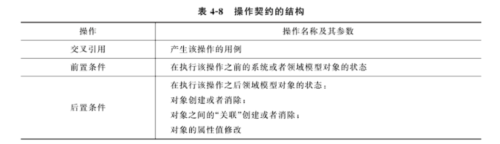
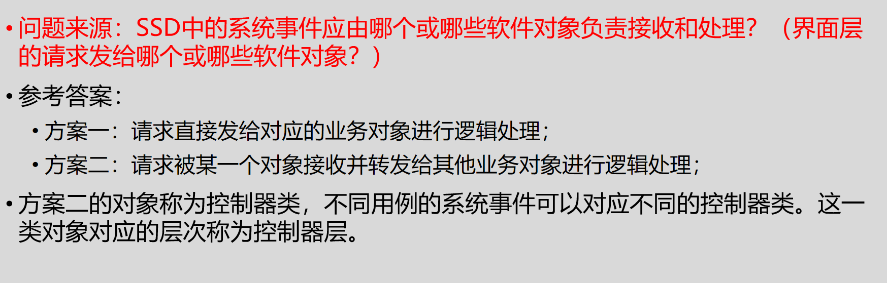

# 🥳软件工程

# 一 软件工程概述

> 软件的定义
>
> 软件的特点
>
> 软件的分类
>
> 软件的发展和软件危机
>
> 软件工程的概念

## 软件的定义

Wirth指出，在结构化程序设计：**程序＝算法＋数据结构**；在软件工程中：**软件＝程序＋文档**。

公认的对**软件的定义**：`<u>`软件是包括程序、数据及其相关文档的完整集合 `</u>`。程序和数据是构造软件的基础，文档是软件质量的保证，也是保证软件更新及生命周期长短的必需品。

## 软件的特点

- **软件是一种逻辑实体，具有抽象性。**
- **软件开发过程中没有明显的制造过程 ，应理解为“创作”。**
- **不存在机械磨损和老化问题，但存在软件退化问题 。**
- 软件的开发和运行受到计算机系统的约束和限制。
- **软件开发至今未完全摆脱手工艺的开发方式（这里也引出软件工程的终极目标）；**
- 软件是复杂的，原因为：
  - 实际需求（业务背景）的复杂性
  - 程序逻辑的复杂性
- 软件研制成本高，软件成本所占比例逐年增加。
- 软件投入运行时还涉及到许多社会因素。

## 软件的分类

**根据软件服务对象的范围不同：**

- 通用软件：操作系统、数据库等；
- 定制软件：企业ERP、办公自动化系统等；

**根据软件完成功能所处的层次不同：**

- 应用软件
- 中间件软件
- 系统软件：指能与硬件紧密配合在一起，使计算机系统各个部件、相关的软件和数据协调、高效地工作

  - 操作系统
  - 设备驱动程序
  - 数据库管理系统等

## 软件的发展和软件危机

软件的发展：

- 程序设计阶段：20世纪50至60年代
- 程序系统阶段：20世纪60至70年代（软件危机就出现在这个阶段）
- 软件工程阶段：20世纪70至90年代
- 现代软件工程阶段： 20世纪90年代至今

软件危机：计算机软件在开发和维护过程中遇到一系列严重问题，导致软件行业的信任危机。具体表现在（**开质用维文**）：

- 软件的开发成本难以估算，无法制定合理的开发计划。
- 用户的需求无法确切表达。
- 软件质量存在问题。
- 软件的可维护性差。
- 缺乏文档资料。

产生软件危机的原因：

- 软件系统本身的复杂性。
- 软件开发的方法和技术不合理不成熟**（最主要）**。

## 软件工程

软件工程定义：运用**工程化原则**和方法，组织软件开发解决软件危机。（注意与需求的工程化区分开）

软件工程的三要素：`<u>`方法、工具、过程 `</u>`。方法提供了“如何做”的技术、工具提供了自动或半自动的软件支撑环境、过程将方法和工具综合起来以达到合理及时地进行计算机软件开发的目的。

**软件工程的目标**：在 `<u>`给定成本和时间 `</u>`的前提下，开发出满足用户需求且具有 `<u>`正确性、可用性 `</u>`等因素的软件产品。

软件工程项目三个基本目标：合理的进度、有限的经费、一定的质量。（和上条类似）

软件工程的终极目标：摆脱手工生产软件的状况，逐步实现软件研制和维护的自动化。

# 二 生命周期模型

> 软件工程过程
>
> 软件生命周期
>
> 传统软件生命周期模型
>
> 新型软件生命周期模型

## 软件工程过程

软件工程项目三个基本目标：合理的进度、有限的经费、一定的质量。

戴明环：PDCA——Plan，Do，Check，Action。

`<u>`软件工程过程 `</u>`是为了获得软件产品，在软件工具的支持下由软件工程师完成的一系列软件工程活动。主要活动：

- 软件规格说明：规定软件功能及其使用限制。
- 软件开发：产生满足规格说明的软件。
- 软件确认：通过有效性验证以保证软件能够满足客户要求。
- 软件演进：为了满足客户变更要求，软件在使用过程中不断地改进。

（简记**发明岩雀**——软件开发、软件规格说明、软件演进、软件确认）

## 软件生命周期

**四个阶段、六个步骤**

软件生命周期概念：软件产品从**考虑其概念**开始，到该产品**不再使用为止**的整个时期。包括**概念阶段、分析与设计阶段、构造阶段、移交和运行阶段**等不同时期。（个人认为可以简单记为P、DD、DC、A）

> 这东西跟后面的RUP模型的四个阶段有区别，注意！

软件生命周期六个基本步骤：**制定计划 P、需求分析 D、软件设计 D、程序编码 D、软件测试 C、运行维护 A**。

**软件过程模型：**从一个**特定角度**提出的对软件过程的概括描述，是对软件开发过程的抽象，包括构成软件过程的各种活动（Activities）、软件工件（Artifacts）以及参与角色（Actors/Roles）等。

**软件生命周期模型**：是一个**框架**，描述从软件需求定义直至软件经使用后废弃为止，跨越整个生存期的软件开发、运行和维护所实施的全部过程、活动（Activities）和任务，同时描述生命周期不同阶段产生的软件工件（Artifacts），明确活动的执行角色（Actors/Roles）等

> 以上两个真的不太会区分，后者似乎比前者的东西要多。

## 传统软件生命周期模型

传统模型种类：瀑布模型、演化模型、增量模型、喷泉模型、V&W 模型、螺旋模型、构件组装模型、快速应用开发模型、原型方法。

### 瀑布模型：是所有其他软件生命周期模型的基础

瀑布模型将软件生命周期划分为3个阶段——**定义阶段、开发阶段**和**维护阶段**，在定义阶段部署了计划和需求分析活动；在开发阶段部署了设计、编码和测试活动，维护阶段部署了运行/维护活动。**这段话来自PPT的注释。**

- 文档驱动，本活动的工作对象来自于上一项活动的输出，这些输出一般是代表该阶段活动结束的里程碑式的文档
- 优点：
  - 降低开发复杂度、提高透明性可管理性。
  - **推迟了软件实现，强调必须先分析和设计。**（简述为什么是优点：“推迟”特指软件编码之前执行了瀑布模型中的需求分析和软件设计等活动，提高了软件质量。）
  - 以文档评审等手段指导整个开发过程。
- 缺点：
  - 缺乏灵活性，无法解决需求不明或不准确的问题。
  - 风险控制能力较弱。（原因：瀑布模型将测试作为软件实现之后的一个独立阶段，使得在分析和设计阶段潜伏下来的错误得到纠正的时机大为推迟，造成较大的返工成本；而且体系结构级别的缺陷也只能在测试阶段才能被发现，使得瀑布模型驾驭风险的能力较低。）
  - 文档过多时，增加工作量。文档并不能完全反映实际项目情况，导致错误结论。
- 适用范围：为早期软件开发消除非结构化软件、降低复杂度、促进软件工程化有显著作用。（就是没什么用）
- Tips：人们觉得这个模型的成功率太低了，所以提出了Do Twice理论，演化模型也就出来了。

### 演化模型

- 提倡两次开发：第一次得到试验性的原型产品，探索可行性，明确需求。第二次在此基础上开发成品。
- 优点：
  - 明确用户需求、提高系统质量、降低开发风险。
- 缺点：
  - 难于管理、结构较差、技术不成熟。
  - 可能会抛弃瀑布模型的文档控制优点。
  - 缺乏设计，可能导致软件系统结构较差。
- 适用范围：**需求不清楚**、小型系统、开发周期短。

### 增量模型

- 首先对系统最核心或最清晰的需求进行分析、设计、实现、测试。再按优先级逐步对后续的需求进行上述开发工作。**结合了瀑布模型和演化模型的优点。**
- 优点：
  - 第一次增量实现系统核心功能，增强客户使用系统的信心。
  - 先开发核心功能，项目总体失败风险较低。
  - 最高优先级的功能先开发，得到最多测试，保障可靠性。
  - 增量在同一体系指导下进行集成，提高稳定性和可维护性。
- 缺点：
  - 难以选择增量粒度。
  - 难以确定所有需求。

### 喷泉模型（迭代模型）

- 高情商：各个开发阶段没有特定次序要求，可以并行进行，可以随时补充遗漏的需求（低情商：想到什么做什么，瞎 JB 写）。
- 优点：提高开发效率、缩短开发周期。
- 缺点：难于管理。
- 适用于：**需求不明晰**。

### V 和 W 模型：

当时人们普遍认为：*相对于编码而言，分析与设计工作更重要，而并没有强调测试的重要性，尽管测试有时会占据项目周期的一半时间*。V模型的价值在于纠正了人们这种错误的认识，将测试分等级，并和前面的开发阶段对应起来。

因此，Paul Rook在瀑布模型基础上改进，把测试活动提前，使得模型能够驾驭风险。Evolutif公司在V模型的基础上提出了W模型。 他俩因为长得像V和W而得此名。

### 螺旋模型：

实践证明：项目规模越大，问题越复杂，资源、成本、进度等因素的不确定性就越大，项目承担风险也就越大。

- 分为四个象限螺旋上升：制定计划、风险分析（不是风险控制，注意区分）、实施工程、客户评价——进入下一回路。
- 适用于：开发周期长、**风险高**的大型软件。

### 构件组装模型：

- 模块化思想，使用复用构件库的组件搭建系统。
- 优点：

  - 软件复用、提高效率。
  - 允许多项目同时开发，降低费用、提高可维护性。
- 缺点：

  - 缺乏通用构建组装标准风险较大。
  - 构建可重用性与系统高效性不易协调。
  - 过分依赖构件，构件质量影响产品质量。

### 快速应用开发模型（RAD）：

- 开发周期 60-90 天，分小组同步进行软件各部分开发。
- 缺点：时间短，需要强沟通配合。不适合所有应用。
- 适用于：信息管理系统的开发。

### 原型方法：和增量好像也没太大区别

首先要知道，完整而准确的需求规格说明是很难一次性得到，因为：

- 在开发早期用户往往对系统只有一个模糊的想法，很难完全准确地表达对系统的全面要求 ；
- 随着开发工作的推进，用户可能会产生新的要求；
- 开发者又可能在设计与实现的过程中遇到一些没有预料到的实际困难，需要以改变需求来解脱困境 。

原型指模拟某种最终产品的原始模型。原型方法指在获得一组基本需求后，通过快速分析构造出一个小型的软件系统原型，满足用户的基本要求。

用户通过使用原型系统，提出修改意见，从而减少用户与开发人员对系统需求的误解，使需求尽可能准确。
**原型方法主要用于明确需求，但也可以用于软件开发的其他阶段。**

原型方法分为**废弃策略**和**追加策略**。

- 优点：

  - 原型提供了用户与开发人员良好的沟通手段，易于被人们接受。（原文太长了，懒得弄过来）
- 缺点：

  - 文档容易被忽略（演化模型也搞这种）。
  - 建立原型的许多工作会被浪费掉。
  - 项目难以规划和管理。

## 新型软件生命周期模型

### RUP 模型：基于瀑布模型演化而来。

- 软件生命周期分解为 4 个阶段：初始阶段**（软件目标里程碑）**、细化阶段**（体系结构里程碑）**、构造阶段**（运行能力里程碑）**、移交阶段**（产品发布里程碑）**。每个阶段结束于一个重要的里程碑。在阶段结尾评估是否满足阶段目标，评估通过允许项目进入下一阶段。
- （简记为**是细狗叫**：初始阶段、细化阶段、构造阶段、移交阶段）

- 特点：

  - **用例驱动，软件体系结构为核心，应用迭代及增量。**
  - RUP由**9**个核心工作流构成每一个迭代的主要活动。
  - 适应性开发：小步骤、快速反馈和调整。
  - 可视化软件建模：使用UML进行软件建模。

### XP 极限编程：基于敏捷建模思想，也是瀑布模型演化而来，没有完整的方法论。

- 强调用户满意，开发人员可以对需求的变化作出快速反应。
- XP提倡配对编程，而且代码所有权是归于整个开发队伍。
- XP提倡在开始写程序之前先写单元测试。

# 三 软件需求分析

> 需求分析之前的活动
>
> 需求的定义
>
> 需求分析的对象、任务、目标
>
> 需求分析的原则
>
> 需求工程
>
> 数据、功能、行为建模
>
> 需求类别

## 需求分析之前的活动

软件的系统分析：

- 预研（Pre-study）:主要探索软件项目的目标、市场预期、主要的技术指标等，用于帮助决策者做出是否进行软件项目立项的决定。
- 可行性分析（Feasibility-study）:针对项目的目标和范围进行概要的分析和研究，探索问题域中的核心问题及其相应的解决方案，进一步为决策者提供经济、技术甚至是法律上可行性的分析报告。

## 需求的定义

Boehm 的需求定义：**研究一种无二义性的表达工具，它能为用户和软件人员双方都接受，并能够把“需求”严格地、形式地表达出来。**

## 需求分析的对象、任务、目标

需求分析的必要性：需求分析是一项必须的软件工程活动。它在系统需求分析和软件设计之间起到桥梁的作用，并构建相应的模型（如下三点）。分析模型成为设计模型的基础，**需求规格说明书**也为软件测试人员和用户提供了软件质量评估的依据。

- 数据模型：哪些数据进出系统、哪些数据需要存储？——5 ER 图
- 功能模型：对数据进行处理的功能有哪些？——5 数据流图
- 行为模型：数据进出系统和被系统功能处理的场景。——5 状态迁移图、时序图、Petri 网等

需求分析的对象：**用户要求**。

需求分析的任务：准确地定义新系统的目标，**回答**系统“做什么”的问题，**编写需求规格说明书**（结果）。

需求分析的目标：导出目标系统的逻辑模型，**解决**目标系统“做什么”的问题。

## 需求分析的原则

需求分析的操作性原则：

- 表示和理解问题的**信息域**（数据）。
- 定义软件**功能**。
- 表示软件**行为**（作为外部事件的结果，或者理解为功能存在的理由）。

需求分析的工程化原则：（简记**分数原eoe**，分析模型、可回溯性、原型、优、义）

- 首先要正确地理解问题，再**建立分析模型**。
- 记录每个需求的起源及原因，保证需求的**可回溯性**。
- 开发一个人机交互过程的**原型**。
- 给需求**赋予优先级**：紧张的开发时间要求尽量避免一次性实现每个软件需求，应采用迭代增量的开发模型。
- 努力**删除歧义性**：因为大多数需求以自然语言描述，存在歧义性的可能性，正式的技术评审是发现并删除歧义性的一种有效方法。

## 数据、功能、行为建模

数据模型：信息和内容关系、信息流、信息结构。

功能模型：对进入软件的信息和数据进行变换的模块，必须至少完成“输入、处理、输出”三个功能。

行为模型：大多数软件对来自外界的事件做出反应。行为模型创建了软件状态的表示，以及导致软件状态变化的事件的表示（状态机）。

## 需求工程

软件的需求分析是一系列复杂的软件工程活动，为了便于对需求进行更好的管理，人们把所有与需求直接相关的活动通称为需求工程。

### 需求获取

需求获取的目的是清楚地理解所要解决的问题，完整地获得用户的需求。并提出这些需求实现条件，以及需求应达到的标准，最后撰写用户需求说明书。**输入：任何与用户需求相关的材料；输出：《用户需求说明书》。**

需求获取的对象：

- 用户：使用软件的人员
- 客户：购买软件的人员

需求获取的难点：

- 用户无法清楚地表达需求
- 需求的理解问题
- 用户经常变更需求

需求获取的准备：

- 明确访谈主题。
- 明确调查方式。
- 确定访谈对象及时间。

### 卡在中间的一个重点

**用户需求说明书与软件需求规格说明书的区别**：1、前者主要采用自然语言来表达用户需求，其内容相对于后者而言比较粗略。2、后者是前者的细化，更多地采用计算机语言和图形符号来刻画需求，软件需求是软件系统设计的直接依据。3、两者之间可能并不存在一一影射关系。

### 需求类别

**功能需求**：列举出所开发软件你在功能上应做什么（最主要需求）。

**性能需求**：给出所开发软件的技术性能指标。系统的实时性和其他时间要求（响应时间、处理时间、消息传送时间等）、资源配置要求、精确度、数据处理量等其他要求。

**环境需求**：软件系统运行时所处环境的要求。① 硬件方面，采用什么机型、有什么外部设备、数据通信接口等。② 软件方面，采用什么支操作系统、数据库管理系统等。③ 使用方面，需要使用部门在制度上、人员技术水平上具备什么样的条件等。

其他需求类别：

- 可靠性需求：软件的有效性和数据完整性。
- 安全保密需求。
- 用户界面需求。
- 资源使用需求：指所开发软件运行时所需的数据、软件、内存空间等各项资源。以及软件开发时的人力物力需求。
- 软件成本消耗与开发进度需求：软件项目立项之后，根据合同规定，对软件开发的进度和步骤费用提出要求，作为开发管理依据。
- 预估将来系统可能达到的目标：在开发过程中对系统将来可能的扩充与修改做准备。

### 需求的分析与综合（感觉就是需求分析，需求分析的时候要建模）

需求获取之后就需要对比较复杂的需求进行建模分析，进而逐步细化所有的软件功能，找出系统各元素之间的联系、接口特性和设计上的限制，分析它们是否满足功能要求，是否合理。

那么，接下来说说需求建模。

软件开发人员还需要构造系统的分析模型，**着重于描述系统必须做什么、而不是如何去做系统。**

给出**（当前、目标）系统**的逻辑视图，以及**（当前）系统**的物理视图。

- 逻辑模型给出软件要达到的功能和处理数据之间的关系，而非实现细节。
- 物理模型给出业务环境中的业务实体和业务处理流程，是抽象出当前系统逻辑模型的基础。

常用的建模分析方法有：

- 面向数据流的结构化分析方法（简称SA）
- 面向数据结构的Jackson方法（简称JSD）
- 面向对象的分析方法（简称OOA）等
- 用于建立动态模型的状态迁移图或Petri网等

### 需求定义

**输入：《用户需求说明书》，输出：《软件需求规格说明书》。**

# 四 面向对象分析

> UML：统一建模语言简介
>
> 领域建模
>
> 用例建模

面向对象的需求分析结果：**需求规格说明书**，由**领域模型**和**用例模型**两个部分组成。

面向对象分析方法中的需求分析包含两个模型：**领域模型**和**用例模型**。

- 领域模型表示需求分析阶段“当前系统”逻辑模型的静态结构及业务流程。领域建模包括领域模型的定义和表示、业务背景：概念类及关系，类图、业务流程：活动图。
- 用例模型是“目标系统”的逻辑模型，定义了目标系统“做什么”的需求。由用例图、用例说明、系统顺序图 SSD、操作契约 Operation Contract 四部分组成。

## UML：统一建模语言简介

发展历程和四个阶段不想写，考了再说。

UML 是一种标准的图形化建模语言，它是面向对象分析与设计的一种标准表示：

- 不是一种可视化的程序设计语言，而是**一种可视化的建模语言**；
- 不是工具或知识库的规格说明，而是**一种建模语言规格说明，是一种表示的标准**；
- 不是过程，也不是方法，但**允许任何一种过程和方法使用它**。

UML 用模型来描述系统的结构**（静态特征）**以及行为**（动态特征）**。从不同的视角为系统的架构建模，形成系统的不同视图（view）， 称为4+1视图：（简记：**萝莉进十步**）

- 用例视图（用户模型视图、场景视图）：强调从用户的角度看到的或需要的系统功能，这种视图也叫做用户模型视图（user model view） 或场景视图（scenario view）。
- 逻辑视图（结构模型视图、静态视图）：展现系统的静态或结构组成及特征，也称为结构模型视图（structural model view） 或静态视图（static view）。
- 进程视图（行为模型视图、过程视图、协作视图、动态视图）：描述设计的并发和同步等特性，关注系统非功能性需求，也称为行为模型视图（behavioral model view）、过程视图（process view）、 协作视图（collaborative view）和动态视图（dynamic view）。
- 实现试图（实现模型视图、开发视图）：关注软件代码的静态组织与管理，也称为实现模型视图（implementation model view ）和开发视图（development view）。
- 部署视图（环境模型视图、物理视图）：描述硬件的拓扑结构以及软件和硬件的映射问题，关注系统非功能性需求（性能、可靠性等），也称为环境模型视图或物理视图（physical view）。

UML 的 9 个基本图：（**顺序用对象作，动太累，不够**）

- `<u>`用例图 Use Case Diagram：从用户的角度描述系统的功能。`</u>`
- `<u>`类图 Class Diagram：描述系统的静态结构（类及其相互关系）。`</u>`

  - UML类图用于**描述类以及类之间的静态关系**。
  - 类包含三个部分：
    - 类名：表示问题域中的概念，含义清晰准确
    - 属性：可见性 属性名：类型名= 初始值 {性质串}
    - 操作：可见性 操作名（参数表）：返回值类型 {性质串}
- `<u>`对象图：描述系统在某个时刻的静态结构（对象及其相互关系）。`</u>`
- `<u>`顺序图 Sequence Diagram：按时间顺序描述系统元素间的交互。`</u>`
- `<u>`协作图 Collaboration Diagram：按照时间空间的顺序描述系统元素间的交互和他们之间的关系。`</u>`
- `<u>`状态图：描述系统元素（对象）的状态条件和响应。`</u>`
- `<u>`活动图：描述了系统元素之间的活动。`</u>`
- 构件图：描述了实现系统的元素（类或包）组织。
- 部署图：描述了环境元素的配置并把实现系统的元素映射到配置上。

UML 视图与图的关系：

- 用例视图：使用用例图和活动图；
- 逻辑视图：使用类图、对象图，顺序图/协作图；
- 进程视图：使用状态图和活动图；
- 构件视图：使用构件图；
- 部署视图：使用部署图。

UML 图的画法：

- 类的基本结构：类名+属性+操作()。
  - 构建领域模型时，不需要操作()。

- 类之间的关系：

## 领域模型

领域模型：领域内**概念类**或**对象**的抽象可视化表示（将客观世界中的事物可视化抽象化）。主要用于概括地描述**业务背景**和重要的**业务流程**，通过类图和活动图展示。

- 业务背景：描述概念类之间的关系，表示成能够代表业务知识结构的 `<u>`类图 `</u>`。
- 业务流程：由角色及其执行的活动构成。由 `<u>`活动图 `</u>`描述。

创建领域模型的步骤：

1. 找出当前需求中的 `<u>`候选概念类 `</u>`。
2. 在领域模型中描述这些 `<u>`概念类 `</u>`。用问题域中的词汇对概念类命名，将与当前需求无关的概念类排除。
3. 在概念类之间 `<u>`添加必要的关联 `</u>`来记录关系。用关联、继承、组合/聚合表示。
4. 在概念类中 `<u>`添加 `</u>`用来实现需求必要的 `<u>`属性 `</u>`。

**领域模型与软件模型的区别：**领域模型所关注的仅仅是客观世界中的事物并将其可视化，而非诸如Java或C#类的软件对象。

以下元素不适用于领域模型：

- 软件制品，例如窗口、界面、数据库；
- 软件模型中具有职责或方法的对象。

**OO的关键思想**：逻辑层（Logic Layer）中软件类的名称要源于领域模型的概念类和职责，减小人们的思维与软件模型之间的表示差异。逻辑层的命名也取自于实际的业务逻辑，表明这些软件类替换了某些业务职责。

识别概念类或属性：

- 属性一般是可以赋值的（如数字、文本），而概念类不可以。
- 如果该名词不能被赋值，那么就“有可能”是一个概念类。
- 如果对一个名词是概念类还是属性不确定，将其作为概念类处理。
- 不存在名词到类的映射机制，因为自然语言具有二义性。

创建领域模型的步骤：

- 第1步，找出当前需求中的**候选概念类**；
- 第2步，在领域模型中描述这些**概念类**。用问题域中的词汇对概念类进行命名，将与当前需求无关的概念类排除在外。
- 第3步，在概念类之间添加必要的**关联**来记录那些需要保存记忆的关系，概念之间的关系用关联、继承、组合/聚合来表示。（下面会写哦）
- 第4步，在概念类中添加用来实现需求的必要属性。

添加关联的方法：

- **“须要知道”型关联**：需要将概念之间的关系信息保持一段时间的关联。领域模型中需要着重考虑。
- “只需理解”型关联：有助于增强对领域中关键概念的理解的关联。

领域模型示例：

## 用例模型

用例模型以用例为核心从使用者的角度描述和解释待构建系统的功能需求，是“目标系统”的逻辑模型，定义了目标系统“做什么”的需求。由四部分组成：

- 用例图
- 用例说明
- 系统顺序图 SSD
- 操作契约 Operation Contract

---

用例图：由三个基本元素组成。

- Actor：称为角色或参与者，使用系统的对象（不一定是人）。
- Usecase：用例，描述 `<u>`角色如何使用系统功能实现需求目标 `</u>`的 `<u>`一组成功场景和一系列失败场景的集合 `</u>`。
- Association：角色和用例之间的关系、用例和子用例之间的关系。

用例分类及其关系：

- 基本用例：与角色直接相关的用例，表示系统的功能需求；
- 子用例：通过场景描述分析归纳出的用例，也表示了系统的功能，但这些用例与角色无直接关系，而与基本用例存在关联关系；
- **包含**子用例：多个基本用例中的某个与角色交互的场景具有相同的操作，且这些场景都是基本用例中必须执行的步骤，可以将其抽取出来作为基本用例的子用例；

- **扩展**子用例：（多个）基本用例中的某些场景存在相同的条件判断的情况，可以将其抽取出来作为基本用例的子用例；

用例图示例：

---

用例说明：基于已经找到的用例和子用例，并参考之前的需求定义以及场景描述的内容，将用例交互的成功场景和失败场景以标准的格式归纳描述。（以答案为例，跟PPT不一样）

---

系统顺序图 SSD：确定角色与系统之间的交互关系，以代码风格命名。包含：

- 角色。
- 代表软件系统的对象，一般使用 system 或系统命名。
- 角色与 system 之间的交互信息，简称消息或操作。

SSD 示例：

---

操作契约：为**系统操作（处理系统事件的操作，也称为系统事件）**定义。领域模型中业务对象接收到系统事件后，执行必须的业务处理时各业务对象的状态以及系统操作执行的结果。

操作契约示例：

# 五 结构化需求分析方法

> 结构化需求分析的由来
>
> 结构化分析模型的组成
>
> 数据词典
>
> 软件需求规格说明书（哈哈，第五章PPT里面没讲）

## 结构化需求分析的由来

分析建模开始于20世纪60-70年代，但结构化分析方法的第一次出现是作为另一个重要课题：“结构化设计”的附属品 。其目的是需要一种图形符号体系来表示数据和对数据进行变换的处理，这些处理最终能被映射到软件体系结构的设计中。 结构化分析这个词汇最初由Douglas Ross提出，由DeMarco进行了推广。

## 结构化分析模型的组成

需求分析的分析模型必须达到三个主要目标：

- 描述客户的需求；
- 建立创建软件设计的基础；
- 定义在软件完成后可以被确认的一组需求。

### 数据建模——ER图

- 概念性数据模型基于实体-关系（ER）法，也称为实体关系模型。描述了从用户角度看到的数据，反映用户现实环境，但与软件系统中的实现方法无关。
- 数据对象描述：描述了数据对象实体的名称及其所有属性。
- 数据对象的基数：一对一、一对多、多对多。

### 功能建模——数据流图

功能建模：当数据或信息流过计算机系统时被系统功能所处理、加工、变换后再从系统输出处理后的数据，表现为**数据流图**。

数据流图的结构：由加工、外部实体、数据流、数据存储组成。

分层数据流图：

- 顶层数据流图：顶层流图仅包含一个加工，它代表被开发系统，其作用在于表明被开发系统的范围，以及它和周围环境的数据交换关系。
- 中间层数据流图：表示对其上层父图的细化。它的每一加工可以继续细化，形成子图。中间层次的多少视系统的复杂程度而定。
- 底层数据流图：是指加工不须再做分解的数据流图，称为“原子加工”。

数据流图的画法：

- 先找系统的数据源点与汇点。它们是外部实体，由它们确定系统与外界的接口。
- 在图的边上画出系统的外部实体。
- 找出外部实体的输出数据流与输入数据流。
- 从外部实体的输出数据流(即系统的源点)出发，按照系统的逻辑需要，逐步画出一系列逻辑加工，直到找到外部实体所需的输入数据流(即系统的汇点)，形成数据流的封闭。（先画顶层数据流图，再细化。）
- 按照上述步骤再从各加工出发，画出所需的子图。
- 按照数据流图检查原则进行检查和修改。

### 行为建模——状态迁移图、时序图（甚至没见过）、Petri 网等

从特定视角出发描述系统行为，采用动态分析的方法，感觉不太考。

## 数据词典

数据词典：对于数据流图中出现的所有被命名的图形元素加以定义，使得每一个图形元素的名字都有一个确切的解释。其定义应是严密的、精确的，不可有半点含混并消除二义性。它由以下内容组成：

- 数据流词条：唯一标识数据流的名称，简要介绍数据流作用。
- 数据元素词条：唯一标识数据元素的名称或编号，简要描述该数据元素的作用，以及位于哪个数据结构内。
- 数据文件词条：唯一标识数据文件的名称，简要描述改文件存放什么数据。
- 加工逻辑词条：唯一标识加工的名称，描述加工逻辑和规则，简述功能。
- 外部实体词条：唯一标识外部实体的名称，指明该实体的性质及与系统的关系。

# 六 软件设计

> 软件设计的目标
>
> 软件设计过程（概要设计、详细设计）
>
> 软件设计模型
>
> 软件设计的一般性原则（面向对象的设计原则）
>
> 软件设计基础
>
> 软件体系结构简介

## 软件设计的目标

根据软件需求分析的结果，设想并设计软件，即根据“目标系统”的逻辑模型确定“目标系统”的物理模型，概括地描述系统如何实现用户所提出来的功能和性能等方面的需求。

软件设计是软件开发的基础和依据，是软件工程过程中的技术核心

软件设计的最终目标是要取得最佳方案（Best Solution，主观）——“最佳”是指在所有候选方案中，就节省开发费用，降低资源消耗，缩短开发时间的条件，选择具有较高的生产率、较高的可靠性和可维护性的方案。

软件设计既是过程又是模型。

软件设计既是过程又是模型。

软件设计既是过程又是模型。

## 软件设计过程

### 软件概要设计

- **制定设计规范。**
- **软件系统结构的总体设计。**
- 处理方式设计（性能设计）。
- 数据结构设计。
- 可靠性设计（质量设计）。
- 界面设计（需求的直接表达方式）。
- **编写软件概要设计说明书。**
- 概要设计评审。

### 软件详细设计

- 确定软件各个功能模块内的算法以及各功能模块的内部数据组织。
- 描述各种算法。
- 编写软件详细设计说明书。
- 详细设计评审。

## 软件设计模型

软件设计模型由两个部分构成：

- 动态结构设计：以某种方式表示功能相应客户请求时处理数据的过程或条件。进一步解释各功能之间如何协调工作。
- 静态结构设计：包括软件的功能结构和数据结构。展示软件系统能满足所有需求的框架结构。

软件的设计活动：

- 系统结构设计、数据结构设计。
- 接口设计、过程设计。
- 界面设计、组件设计、优化设计等。

## 软件设计的一般性原则

### 衡量设计过程的技术原则

- 设计过程应该是可追踪和可回溯的。
- 设计必须实现分析模型中描述的所有显式需求；
- 必须满足用户希望的所有隐式需求。
  - 所谓隐式需求，如系统的安全性要求，降低或消除功能性错误，数据安全和完整性要求等。
- 对于开发者和未来的维护者而言，设计说明文档必须是可读的、可理解的，使得将来易于编程、易于测试、易于维护。

### 衡量设计模型的技术原则

- 设计模型应该展现软件的全貌，包括从实现角度可看到的数据、功能、行为。
- 设计模型应该是一个分层结构。该结构：
  - 使用可识别的设计模式搭建系统结构；
  - 由具备良好设计特征的构件构成；
  - 可以用演化的方式实现；
- 设计应当模块化，即应当建立具有独立功能特征的构件。
- 设计应当建立能够降低模块与外部环境之间复杂连接的接口。
- 设计应当根据将要实现的对象和数据导出合适的数据结构。

### 软件的模块化

模块（module）定义：这个软件可被划分成若干个**可单独命名且可编址组成部分**，这些部分称为模块。模块具有三个基本属性：

- 功能：做什么。
- 逻辑：怎么做。
- 状态：模块使用时的环境和条件。

模块的表示：

- 模块的外部特性：模块的名字、参数表、功能（对程序其他环境造成的影响）。
- 模块的内部特性：完成其功能的代码和内部数据。

### 软件模块的划分

按照自顶向下的设计原则，需将一个大规模的软件分解成若干相对独立的模块，然后分别对这些规模较小的模块进行处理。**难点在于合理的划分模块**

- 如果模块是相互独立的（模块独立性），当模块变得越小，每个模块花费的工作量越低 
- 但当模块数增加时，模块间的联系也随之增加（模块的耦合度），把这些模块联接起来的工作量也随之增加。

#### 信息隐藏

David Parnas 指出，每个模块的实现细节对于其它模块来说应该是隐蔽的。模块中所包含的信息（包括数据和过程）不允许其它不需要这些信息的模块使用。模块之间的关系能够达到信息隐藏，就可以认为是合理的模块划分。

#### 抽象化

模型是人类抽象活动的一种表现形式。在软件设计过程中按照自顶向下的设计原则，可通过不同层次的抽象，逐步细化软件的结构。

- 过程抽象：
  - 软件计划阶段：软件被看作是一个相对宏观的系统元素
  - 软件需求分析阶段：用“问题所处环境的为大家所熟悉的术语”来描述软件的解决方法。 
  - 概要设计阶段：使用规定的符号表示软件的轮廓和结构
  - 详细设计阶段：使用面向代码的符号表示软件的内部结构
- 数据抽象：数据抽象与过程抽象一样，允许设计人员在不同层次上描述数据对象的细节。 
- 控制抽象：可以包含一个程序控制机制而无须规定其内部细节。 

### 模块设计的标准

- 模块可分解性：可将系统按问题/子问题分解的原则分解成系统的模块层次结构;
- 模块可组装性：可利用已有的设计构件组装成新系统，不必一切从头开始。
- 模块可理解性：一个模块可不参考其他模块而被理解；
- 模块连续性：对软件需求的一些微小变更只导致对某个模块的修改而整个系统不用大动;
- 模块保护：将模块内出现异常情况的影响范围限制在模块

### 模块的独立性

- 功能独立性是抽象、模块化和信息隐藏的直接产物。
- 如果一个模块能够独立于其他模块被编程、测试和修改，而和软件系统中其它的模块的接口是简单的，则该模块具有功能独立性。 
- 1978年Meyer提出了两个准则度量模块独立性，即**模块间的内聚**和**模块的耦合**。

### 模块的内聚性

内聚性越高，模块功能独立性越强。相对地，它与其他模块之间的耦合性就会减低。

| 内聚类型 | 描述                                                                                                |
| :------- | :-------------------------------------------------------------------------------------------------- |
| 巧合内聚 | 内聚程度最低。模块内凑巧有一些程序段代码相同，又没有明确表现出独立的功能，应当抽象为一个新的模块。  |
| 逻辑内聚 | 把几种相关的功能组合在一起，每次调用由模块根据参数确定执行那一部分功能。（if-else）                 |
| 时间内聚 | 又称经典内聚。一般为多功能模块，各个功能的执行与时间有关。例如初始化模块、终止模块。                |
| 过程内聚 | 把流程图中的一部分划出组成模块。例如，把一个流程中的循环部分、判定部分、计算部分分成三个模块。      |
| 通信内聚 | 一个模块完成多个功能，各功能都在同一个数据结构上操作，每个功能有唯一入口。例如对某数据结构的 CRUD。 |
| 功能内聚 | 内聚程度最高。一个模块中各个部分都是完成某一具体功能必不可少的组成部分，紧密联系，不可分割。        |

### 模块的耦合性

耦合性越高，模块间联系越紧密，独立性越弱。应当避免高耦合。

| 耦合类型   | 描述                                                                                                                                 |
| :--------- | :----------------------------------------------------------------------------------------------------------------------------------- |
| 非直接耦合 | 耦合性最低。两个模块之间没有直接关系，通过父级模块控制和调用各自实现功能。                                                           |
| 数据耦合   | 一组模块通过参数表简单变量交换信息。                                                                                                 |
| 标记耦合   | 一组模块通过参数表传递记录信息。这个记录是某一数据结构的子结构，不是简单变量。（违反了通信内聚原则）                                 |
| 控制耦合   | 一个模块通过传送开关、标志、名字等控制信息明显地控制另一模块的功能。                                                                 |
| 外部耦合   | 一组模块都访问同一全局简单变量（而非数据结构），并且不通过参数表传递该变量信息。                                                     |
| 公共耦合   | 一组模块访问同一个公共数据环境。如全局数据结构、共享通信区、内存公共覆盖区等。                                                       |
| 内容耦合   | 耦合性最高。一个模块直接访问另一模块内部数据、不通过正常入口转到另一模块内部、两模块有部分代码重叠、一个模块有多个入口。（垃圾代码） |

### 模块的耦合度计算

0.67 低耦合；1.0 高耦合

### 降低模块耦合度的方法

根据问题的特点选择适当的耦合类型

- 模块间的信息传递：数据信息和控制信息的选择；
- 模块间的调用方式：传送地址和传送判定参数的选择；
- 系统的错误处理模块：集中处理与分散处理的选择；

降低模块接口的复杂度

- 传送信息的数量：参数多和参数少的区别；
- 模块的调用方式：简单调用和直接引用的区别；

将模块的通信信息放在缓冲区中

### 面向对象的设计原则

7个原则：

- 单一职责原则：引起一个类**变化的原因**（职责）应该只有一个。
- 开闭原则：类、模块、函数可以扩展，但不能修改原有代码（Open for extension，Closed for modification）。
- 里氏替换原则：子类应当可以替换父类，并出现在父类能够出现的任何地方。
- 依赖倒置原则：
  - 高层模块不应依赖于底层模块，二者都应依赖于抽象。抽象不应依赖于细节，细节应该依赖于抽象。
  - 程序中所有依赖关系都应终止于抽象类或接口。
- 接口隔离原则：若一个服务类为多个客户类提供不同服务，则服务类针对每个不同服务都应该有一个接口。
- 组合/聚合复用原则：在一个新对象里面使用一些已有对象，使之成为新对象的一部分。新对象通过向已有对象委托（delegate）一部分职责而达到复用已有对象的目的。（不要继承，要组合/聚合）
- 迪米特法则：最少知识原则。一个对象应当尽可能少地了解其他对象。（对象只与 this、本对象方法中的参量、当前对象实例直接引用的对象、对象实例聚集中的其他元素、当前对象创建的对象通信）

## 软件设计基础

### 自顶向下，逐步细化

将软件的体系结构按自顶向下方式，对各个层次的过程细节和数据细节逐层细化，直到用程序设计语言的语句能够实现为止，从而最后确立整个的体系结构。 

- 最初的说明只是概念性地描述了系统的功能或信息，但并未提供有关功能的内部实现机制或有关信息的内部结构的任何信息。 
- 对初始说明仔细推敲，进行功能细化或信息细化，给出实现的细节，划分出若干成份。

### 系统控制结构

系统控制结构表明了程序构件（模块）的组织情况。控制层次往往用程序的层次（树形或网状）结构来表示。

### 结构划分

程序结构可以按水平方向或垂直方向进行划分（结构化程序设计）

#### 水平划分

水平划分按主要的程序功能来定义模块结构的各个分支。 

- 优点是：由于主要的功能相互分离，易于修改、易于扩充，且没有副作用。
- 缺点是：需要通过模块接口传递更多的数据，使程序流的整体控制复杂化。 

#### 垂直划分

也叫做因子划分，主要用在程序的体系结构中。

- 优点是：对低层模块的修改不太可能引起副作用的传播 

### 结构图

### 数据结构

### 软件过程

## 软件体系结构简介

### 定义

Garlan & Shaw 模型：软件体系结构 = **{构件，连接件，约束}**

### 三要素

程序构件（模块）的层次结构

构件之间交互的方式

数据的结构

### 软件构件的分类与调用方式

### 软件体系结构风格

**软件体系结构风格是描述某一特定应用领域中系统组织方式的惯用模式**（设计模式）：

#### 四要素

体系结构风格具有四个主要元素，即**提供一个词汇表、定义一套配置规则、定义一套语义解释原则和定义对基于这种风格的系统所进行的分析**。——反映了领域中众多系统所共有的结构和语义特性。

#### 具体风格

- 管道和过滤器风格：参考 Unix/Linux。通过过滤器进行数据处理、通过管道进行信息流传递。
  - 构件：在管道和过滤器风格中，构件被称为过滤器（filter）。它对输入流进行处理、转换，处理后的结果在输出端流出。而且，这种计算处理方式是递进的，所以可能在全部的输入接受完之前就开始输出。此外，系统中可以并行地使用过滤器。
  - 连接件：连接件位于过滤器之间，起到信息流的导管作用，被称为管道（pipe）。

- 
- 调用和返回风格：大型软件开发主流体系结构
  - 主程序/子程序风格：将程序化分为若干小片段，封装为子程序。主程序单线程控制。
  - **对象风格**：数据的表示方法和相应操作封装在抽象数据类型或对象中。对象通过函数和过程调用交互。
  - **分层风格**：将系统组织称一个结构，通过接口，每一层为上层提供服务，并作为下层的客户端。
- 基于事件的风格：构件不直接调用过程，而是声明或广播事件。其他构件通过向系统注册监听事件，完成相应操作。
- 
- 客户端/服务器风格：应用程序的数据和处理分布在一定范围内的多个构件上，构件之间通过网络连接。
- 
- 解释器(虚拟机)风格：该风格通常用于建立一种虚拟机去弥合程序的语义与作为计算引擎的硬件的差异。适用于应用程序不能直接运行在最合适的机器上或不能直接以最适合的语言执行  。
  - 程序设计语言的编译器，如Java，Smalltalk等。
  - 基于规则的系统，比如专家系统领域的Prolog等。
  - 脚本语言，比如Awk，Perl等

- 仓库风格：仓库风格的体系结构由两种构件组成：中央数据结构，表示当前状态；独立构件的集合，它对中央数据结构进行操作。
- 黑板风格：通常用于松散的构件访问共享数据的应用程序。
- **MVC 风格**：模型-视图-控制器风格通常简称为MVC（Model-View-Controller）风格，模型（数据与状态）与视图（显示）分离，通过控制器（封装若干接口）控制。

# 七 面向对象设计

> 面向对象设计综述
>
> 模型的层次化
>
> 面向对象设计原则
>
> 设计用例实现方案

## 面向对象设计综述

### 面向对象的设计

以需求分析阶段的**用例模型**和**领域模型**为基础，运用 UML 构建软件系统结构，通过一系列设计模型说明用例的实现过程。

### 主要设计活动

- 选择合适的软件架构；
- 根据架构通过**UML交互图**描述**每个用例的实现过程**；
- 最终给出以**UML类图**表示的能够满足**所有用例的系统静态结构**；
- 根据系统的设计原则进行**优化**。

### 面向对象的设计与UML

#### 软件概要设计

- 选择合适的软件架构；
  - 三种基础架构：单机、CS 和 BS、云服务。
  - 服务器端的分层：控制器层+应用逻辑层（必须）+基础架构层+持久化层+DB（必须）
- 系统的动态结构设计：

  - 用例实现过程设计，针对用例对应的SSD中的每个系统事件，运用UML的 sequence diagram **顺序图** / collaboration diagram **协作图** 给出符合该系统事件定义的操作契约的内容；
  - 如果软件对象具有多种不同的职责（主要考虑对应于不同的用例）的情况下，需要运用 state machines diagram **状态机图** 对该软件对象进行状态迁移的设计；
- 系统的静态结构设计
  - 对所有用例或者子系统级别的用例的交互图进行归纳，运用UML的 Class diagram **类图** 给出系统的静态结构；

#### 软件详细设计

针对系统静态结构中每个对象的方法，运用UML activity diagram **活动图** 对其进行逻辑结构的设计。

### 面向对象设计的关键步骤

在确定软件框架结构的基础上，进行以下内容的设计

- 发现对象（发现软件类）：根据需求和选择的架构和模式确定系统由哪些对象构成；
- 确定对象属性：明确该对象应该具有的特征属性；
- 确定对象行为：明确对象应具有的功能和职责；
- 确定对象之间的关系：根据系统顺序图及操作契约以及选择的架构和模式明确系统是如何相互协作完成功能需求的交互过程；

## 模型层次化

层次化设计模型符合面向对象设计原则，并使系统易于扩展和维护。

- 用户界面层：（用例）系统功能的各种界面表现形式。尽量与业务分离，专门处理交互。

- 控制器层：用于协调、控制其他类共同完成用例规定的功能或行为。专职接收 SSD 中的系统事件，进行 validation，并转发给应用逻辑层对象处理。

- 业务逻辑层：实现用例要求的各种系统级功能、核心功能。

- 持久化层：用于保存需要持久化存储的数据对象。负责 CRUD 经过业务逻辑层处理后的需要持久化（将对象状态永久保存到物理介质）的数据。与业务逻辑层功能分离，与数据库保持同步。持久化层将对数据库的操作类封装起来，向业务/领域对象提供持久化服务，是数据库变化对业务领域影响的范围局部化。

- 系统层：为应用提供操作系统相关的功能，通过把特定于操作系统的特性包装起来，使软件与操作系统分离，增加应用的可移植性。

  

## 面向对象设计原则

### 控制器层对象设计原则

### 业务/应用层对象设计原则

### 持久化层对象设计原则

#### 为何引入持久化类

持久层将对数据库的操作类封装起来，提供专门数据管理功能，向业务/领域对象提供持久化服务，从而使数据库变化对业务领域的影响的范围局部化。

## 设计用例实现方案

面向对象的设计过程也可称为**用例实现**的设计。

用例实现：在设计模型中描述分层结构中相互协作的软件对象如何实现用例的各个特定场景，包括所有的成功和失败场景。

用例实现的设计方案：根据选择的分层结构，结合需求分析的结果找到各层次对应的软件对象，并给出这些对象的交互场景以实现用例的要求。**使用UML 的sequence/collaboration diagram 进行绘制。**

进一步根据找到的软件对象在交互图中的接收和发送的消息，确定软件对象应该具有软件方法和属性。

完成从分析模型到设计模型的的转变过程。

### 面向对象的设计模式

- **对象的职责通过调用对象的方法来实现。**
- **面向对象设计最关键的活动是正确地给对象分配职责。**
- **模式定义了一组相互协作的设计类，包括类的职责、类之间的交互方式。**

### 模式的组成

模式名称：一个助记名，用一两个词描述模式的问题、解决方案和效果；

问题：描述了何时使用模式。或者说模式的使用问题域；

解决方案：描述了设计的组成部分、组成部分之间的相互关系及各自的职责和协作方式；

效果：描述了模式应用的效果和使用模式应权衡的问题。

如何确定设计类并分配职责？类职责分配模式、控制器模式、建造者模式、信息专家模式。

#### 类职责分配（Grasp）模式

- 设计类的来源有两部分：

  - 核心逻辑由领域模型中的**概念类**转换而来。
  - 另一部分是为了实现新增的类，如负责对象持久化的类、负责通信的类。
- 每个设计类都有明确的职责，分为两种类型：

  - 了解型（knowing）职责（自己干自己的事）：

    - 对象了解自己私有的数据。
    - 对象了解相关联的对象。
    - 对象了解能够派生或计算的事物。
  - 行为型（doing）职责（自己干自己能干的事）：

    - 对象自身能执行一些行为，如创建一个对象或者进行计算。
    - 对象要能启动其他对象中的动作。
    - 对象要能控制或协调其他对象中的活动。

    职责的内聚（自己只干自己的事）：减少不必要的关联，提高内聚性。

#### 控制器（Controller）模式

把处理和接收系统事件的职责分配给位于控制器层的对象。提供一个统一的接口去访问多个子系统的多个不同的接口，它为子系统中的一组接口提供一个统一的高层接口。使得子系统更容易使用。

- 外观（facade）控制器：代表整个系统。
- 用例控制器或会话控制器：代表一个发生系统事件的用例场景。这个类通常命名为 `<用例名>控制器`。
- 在相同的用例场景中使用同一个控制器类处理所有的系统事件。
- 一次会话是与一个参与者进行交谈的一个实例。

**指导原则**：不论是外观控制器还是用例控制器，它们只是接收系统事件消息，并没有实现系统操作的职责，系统操作应该委托给领域对象处理。

#### 建造者（Creator）模式

用于**操作契约中对象实例的创建**。体现低耦合设计思想，**是迪米特法则的具体运用**。

- 若以下条件满足一个或多个：

  - B 聚合或包含 A，B 记录对象 A，B 密切使用对象 A，B 拥有创建对象 A 所需要的初始化数据。

  则可将创建类 A 实例的职责分配给类 B。

#### 信息专家（Information Expert）模式

这是**给对象分配职责的通用原则**：职责分配给拥有履行职责所必需信息的类（信息专家）完成。

### 创建交互图

根据选择的系统架构，使用 UML 的交互图，为该用例的每一个**系统事件**确定对应的软件对象，并根据操作契约确定对象之间的关系。

#### 可能是一种画法

#### 更常见的画法

### 创建设计类图

**设计类图定义类、类的属性和操作**，但不定义实现操作的算法。

- 扫描所有交互图以及领域模型中涉及的类，识别软件类。
- 将领域模型中已经识别出来的部分属性添加到类中。
- 根据交互图为软件类添加方法。忽略构造函数和 getter/setter。
- 添加更多类型信息。包括属性类型、方法参数类型、返回类型。
- 添加关联和导航。定义 A 到 B 带导航关联修饰的常见情况：A 发送一个消息到 B、A 创建一个 B 的实例、A 需要维护到 B 的一个连接。
- （可选）类成员的细节表示。如属性可见性、方法体的描述等。

例：

### 动态结构设计总结

输入条件：

- 用例
- SSD
- 操作契约
- 领域模型

输出结果：用例的一系列交互图，展示并证明系统如何执行用例的过程

- 确定了用例对应的软件对象及其交互；
- 确定了每个软件对象在该用例中必须具备的方法；

### 用例级别 静态结构设计总结

输入条件：用例的动态结构

输出结果：用例级别的静态类图

- 确定每个软件类的属性及类型定义；
- 确定每个软件类的方法及参数定义；

**系统级静态结构**：对每个用例的静态类图进行扫描，去除重复出现的软件类，修改并确定软件类层次之间以及同层软件类之间的关系

# 八 结构化软件设计

> 系统功能结构图
>
> **变换映射**
>
> **事务映射**
>
> 优化系统功能结构图
>
> 设计后处理
>
> 详细设计

## 系统功能结构图

功能结构图的基本结构：四种基本类型模块

- 传入模块：从下属模块取得数据，经过处理，将其传送给上级模块。
- 传出模块：从上级模块获得数据，经过处理，将其传送给下属模块。
- 变换模块：即加工模块。从上级模块获得数据，进行处理，再传送回上级模块。
- 协调模块：对所有下属模块进行协调和管理的模块。

通常，系统功能结构图（根据数据流图中加工特性）分为以下两种结构：

- 变换处理型
- 事务处理型（并发处理型）

原子模块：结构图中不能再分解的底层模块；

因子分解系统：

- 所有系统的加工处理都由原子模块完成；
- 其它非原子模块仅仅进行控制和协调的功能。

## 变换映射

变换型结构工作过程大致三步：**取得数据、变换数据、给出数据**。

会画就行。（**左边画左边，右边画右边**，希望你复习的时候记得这句话）

## 事务映射

事务型结构：存在某一个数据流**节点**，引发**一个或多个相同的处理**，并将**处理结果返回给该节点**，则该数据流就叫做事务，该节点称为事务处理中心。

- 事务处理中心
- 事务处理加工

事务是最小的工作单元，无论成功与否都作为一个整体进行工作。

- 原子性
- 一致性
- 隔离性
- 持久性

## 变换-事务混和型结构

摆了，他自己复习的时候也没讲明白，哈哈。

## 软件模块的优化原则

- 模块功能的完善化 
- 消除重复功能，改善软件结构 
- 模块的作用范围应在控制范围之内
- 尽可能减少高扇出结构 
- 避免或减少使用病态联接 
- 模块的大小要适中 
- 设计功能可预测的模块，避免过分受限制的模块 
- 软件包应满足设计约束和可移植性

## 设计后处理

在经过变换映射和事务映射之后，还需要为所获得的系统功能结构图进行说明，形成《概要设计说明书》，包括以下内容：

- 必须为每一个模块写一份处理说明；
- 为每一个模块提供一份接口说明；
- 确定全局数据结构和局部数据结构；

## 详细设计

从软件开发的工程化观点来看，在编制程序以前，需要对所采用算法的逻辑关系进行分析，设计出全部必要的过程细节，并给予清晰的表达，使之成为编码的依据，这就是详细设计的任务。

表达详细设计规格说明的工具叫做详细设计工具，它可以分为三类：

- 图形工具
- 表格工具
- 语言工具

# 九 程序实现

> 软件实现的目标与任务
>
> 程序语言的选择
>
> 源程序文档化

## 目标与任务

软件实现是软件详细设计的后续阶段及任务，即程序编码；

程序编码需要根据具体情况条件确定具体的程序设计语言；

按照详细设计及概要设计的要求转换成选定的编程语言；

进一步按照要求进行必要的软件单元测试，使可执行程序达到软件的质量要求。

### 程序语言的选择

参考应用领域；

根据用户的要求；

参考现有的工具及环境；

程序员的能力水平；

可移植性的要求；

## 源程序文档化

从软件工程的角度，对于源程序除了质量要求之外，为了后期代码的维护和更改，还必须从提高可阅读性，即达到源程序文档化。

- 标识符命名：模块名（类名及方法名），变量/常量名
  - 名称需标示清楚具体含义，采用前缀后缀增加可阅读性。
  - 使用专业术语（业务词汇），避免与编码语言关键字冲突。
  - 注意大小写及长度。
- 源程序布局：
  - 编码之前定义统一的编码规范。
  - 规定合理的注释、缩进、空格、空行等方式。
- 程序注释：
  - 序言性注释：位于代码之前，说明该模块（类及方法）具体作用。包括：
    - 程序标题：模块名称。
    - 模块描述：该模块的功能和目的说明。
    - 主要算法（可选）：说明采用的算法结构。
    - 接口说明：说明该模块与其他模块的调用关系。
    - 开发简历：创建者、创建时间。修改者、修改时间、修改内容、版本。
  - 功能性注释：对于程序体中复杂难于理解的程序结构进行局部说明。
    - 主要描述一段程序，必要时对某一段进行说明；
    - 修改代码的同时，对应的功能性注释也要进行修改

# 十 软件测试

> 白盒测试
>
> 黑盒测试
>
> 测试基本类型

## 软件测试的目的

软件测试的定义：以最少的时间和人力，系统地找出软件中潜在的各种错误和缺陷，并证明软件的功能和性能与需求说明相符合。

目的如下：

## 软件测试的原则

- 测试用例由**测试输入数据和预期的输出结果**两部分组成。
- 程序员应避免检查自己的程序。（？不懂）

## 软件测试对象

- 软件测试并不等于程序测试。软件测试应贯穿于软件定义与开发的整个周期。
- 软件开发各阶段所得到的文档，包括需求规格说明、概要设计规格说明、详细设计规格说明以及源程序，都应成为软件测试的对象。

## 软件测试与软件各阶段的关系

## 两种常用的软件测试方法

**白盒测试：**将测试对象看作一个透明的盒子，允许利用程序内部逻辑结构以及有关信息，设计或选择测试用例，对程序所有逻辑路径进行测试。通过在不同点检查程序的状态，确定实际的状态是否与预期的状态一致。又称为结构测试或逻辑驱动测试。

**黑盒测试：**完全不考虑程序内部的逻辑结构和特性，只依据程序的需求规格说明书和概要设计说明，检查程序的功能是否符合它的功能说明。又称为功能测试或数据驱动测试。

## 白盒测试方法

白盒测试主要应用于**单元测试**，是检查**程序逻辑错误**的主要方法。

进行如下检查：

- 程序模块所有独立执行路径至少测试一次。
- 对所有的逻辑判定，true 和 false 的情况都至少测试一次。
- 在循环的便捷和运行界限内执行循环体。
- 测试内部数据结构的有效性，等。

### 逻辑覆盖

> 这部分看一下PPT

逻辑覆盖是一程序内部的逻辑结构为基础设计的测试用例技术。

- 语句覆盖：使得每一个可执行语句至少执行一次。语句覆盖发现不了判断中逻辑运算中出现的错误，是最弱的逻辑覆盖准则。
- 判定覆盖：使得程序中每个判断的取真分支和取假分支至少经历一次，又称为分支覆盖。判定覆盖还不能保证一定查出在判断的条件中存在的错误，因此需要更强的逻辑覆盖准则检验判断内部条件。
- 条件覆盖：使得程序中每个判断的每个条件的可能取值至少执行一次。
- 判定+条件覆盖：使得判断中每个条件的所有可能取值至少执行一次，同时每个判断的所有可能判断结果取值至少执行一次。采用判定-条件覆盖，逻辑表达式中的错误不一定能够查得出来。
- 条件组合覆盖：使得每个判断的所有可能的条件取值组合至少执行一次。需要将多重条件判断分解成有多个基本判断组成的流程图。
- 路径覆盖：设计足够的测试用例，覆盖程序中所有可能的路径。**这种测试仍然无法满足条件组合覆盖某些条件，也并非是完善的测试方法。**

**在实际的测试用例设计过程中需要综合以上 6 种测试方法去设计测试用例。以路径覆盖为主，辅助其他 5 种方法。**

### 基本路径测试

对于具有循环结构的程序，路径过多，做到路径覆盖有难度。基本路径测试基于程序控制流图对程序进行简化，得到程序的控制结构，进而分析控制结构的环路复杂性，导出基本可执行路径集合，设计测试用例。

这个方法需引入程序控制流图：基于程序流程图进行简化，得到程序的控制结构。

#### 控制流图的转换

- 顺序结构的多个结点可以合并为一个结点。
- 在选择或多分支结构中，分支的汇聚处应有一个虚拟汇聚结点。
- 边和结点圈定的范围叫做区域，当对区域计数时，图形外的范围也应记为一个区域。
- 如果判断中的条件表达式是由一个或多个逻辑运算符连接的复合条件表达式，则需要改为一系列只有单个条件的嵌套的判断。

#### 控制流图的环路复杂度计算

- 控制流图的环路复杂度（McCabe 复杂度）确定程序中独立路径的上界，以此为依据可找出程序中全部独立路径。
- 环路复杂度三种计算方法：
  - 等于控制流图中的区域数，包括封闭区域和开放区域。
  - 设 E 为控制流图的边数，N 为图的结点数，则环路复杂度定义为\(V(G)=E-N+2\)。
  - 设 P 为控制流图中的判定结点数，则有\(V(G) = P+1\)。
- 基本路径集：指程序控制流图中，从入口到出口的至少经历一个从未走过的边的不同路径的集合。
  - 给定控制流图，基本路径集不是唯一的。
  - 最大基本路径条数就是环路复杂度。

#### 导出测试用例

- 根据控制流图的基本路径导出测试用例，确保基本路径集中每一条路径执行。
- 根据判断结点给出条件，选择适当数据保证每一条路径可被测试到（使用逻辑覆盖）。
- 每个测试用例执行后与预期结果比较，若所有测试用例执行完毕，则确信程序中所有可执行语句至少被执行一次。

举例：

## 黑盒测试方法

黑盒测试方法一般用于**集成测试、系统测试和验收测试**，某些特殊情况也会用到单元测试。（确认测试不用？）

常用方法：

- 等价类划分：按区间、数值集合、布尔值等规则将输入空间划分为有效等价类与无效等价类，使用等价类的一个或几个代表值进行测试。
- 边界值分析：对等价类划分的补充。使用对于等价类而言稍高于其边界值或低于其边界值的一些特殊情况进行测试。
- 因果图：自己看吧。

黑盒测试方法用于测试程序接口，主要是为了发现以下错误：

- 是否有不正确或遗漏的功能？
- 是否能正确接受输入、输出正确结果？
- 是否有数据结构错误或外部信息访问错误？
- 性能是否满足要求？
- 是否有初始化或终止性错误？

### 等价类划分

黑盒测试方法不能选用穷举方式，为此通过寻找具有代表意义的数据进行替代其它同类型的数据，称为等价类。

并合理地假定：测试某等价类的代表值就等价于对这一类其它值的测试。使用这一方法设计测试用例要经历划分等价类（列出等价类表）和选取测试用例

划分等价类：根据输入域的要求和数据类型定义寻找等价类，确定等价类表结构。

等价类的划分有两种不同的情况：

- 有效等价类：是指对于程序的规格说明来说，是合理的，有意义的输入数据构成的集合。
- 无效等价类：是指对于程序的规格说明来说，是不合理的，无意义的输入数据构成的集合。

### 划分等价类原则

### 确定测试用例

### 等价类划分举例

#### 例一

#### 例二

### 边界值分析

### 因果图

**绘制因果图可以减少测试样例的数目**

#### 因果图的符号

#### 实例——自动售货机

分析步骤

- 建立原因
- 建立对应的结果
- 建立中间结果
- 绘制因果图并添加约束条件
- 建立判定表

## 五个软件测试的基本类型

### 单元测试

编码阶段运用白盒测试方法，对已实现的最小单位代码——**程序模块**进行正确性检查。包括：

- 路径测试
- 接口测试
- 边界条件测试
- 局部数据结构测试
- 错误处理测试

### 集成测试

编码阶段在单元测试的基础上，运用黑盒测试方法检查被测单元的接口问题，并检查代码集成后各功能的完整性。需要将所有模块按照设计要求集成成为系统。

#### 两种集成测试方法

**一次性集成方式**

首先对所有模块进行单元测试，然后再把所有模块集成在一起进行测试，最终得到要求的软件系统。

**增殖式集成方式**

首先对每个模块进行模块测试，然后将这些模块逐步集成成较大的系统；在集成的过程中边连接边测试；最后逐步集成成为要求的软件系统。

- 自顶向下的增殖方式
  - 这种方式将模块按系统程序结构，沿控制层次自顶向下进行集成。
  - 自顶向下的增殖方式在测试过程中较早地验证了主要的控制和判断点。选用按深度方向集成的方式，可以首先实现和验证一个完整的软件功能。
- 自底向上的增殖方式
  - 这种集成的方式是从程序模块结构的最底层的模块开始集成和测试。
  - 因为模块是自底向上进行集成，对于一个给定层次的模块，它的子模块（包括子模块的所有下属模块）已经集成并测试完成，所以不再需要桩模块。
- 混合增殖式
  - 衍变的自顶向下的增殖测试
    - 首先对输入／输出模块和引入新算法模块进行测试;
    - 再自底向上集成成为功能相当完整且相对独立的子系统;
    - 然后由主模块开始自顶向下进行增殖测试。
  - 自底向上-自顶向下的增殖测试
    - 首先对含读操作的子系统自底向上直至根结点模块进行集成和测试;
    - 然后对含写操作的子系统做自顶向下的集成与测试。
  - 回归测试
    - 这种方式采取自顶向下的方式测试被修改的模块及其子模块;
    - 然后将这一部分视为子系统，再自底向上测试。

### 确认测试

开发后期，针对系统级的软件，采用**黑盒方法**验证被测软件是否满足需求规格说明书列出的需求。确认测试又称**有效性测试**。

### 系统测试

在开发环境或实际运行环境中，将**通过确认测试**的软件，以系统需求分析规格说明书作为验收标准，~~对软硬件系统进行的一系列集成和确认测试~~对计算机系统进行一系列的组装测试和确认测试。

包括：

- 功能/性能测试；
- 压力/强度测试；
- 大数据量测试；
- 安全性/易用性测试；
- 文档测试......

### 验收测试

在实际运行环境中，试运行一段时间后，确认系统功能和性能符合生产要求。验收通过后交付用户使用。

# 十一 软件维护、软件项目管理

### 软件维护的定义

在软件已经交付使用之后，为了改正错误或满足新的需要而修改软件的过程，即在软件运行∕维护阶段对软件产品所进行的一切改动。**软件维护周期中包括多次的软件开发活动。**

### 软件维护的分类

- 改正性维护：为了识别和纠正软件错误、改正软件性能上的缺陷、排除实施中的误使用而进行的诊断和改正错误的过程（**救火式维护**）
- 适应性维护：为了使软件适应外部环境或数据环境的变化，而去修改软件的过程
- 完善性维护：为了满足用户对软件提出新的功能与性能要求而去修改和再开发软件的过程
- 预防性维护：采用先进的软件工程方法对需要维护的软件或软件中的某一部分(重新)进行设计、编制和测试

### 软件项目管理

- **启动**软件项目：这是软件项目管理的第一个过程，目的是确定软件项目的目标、范围。通常，软件人员和用户是在系统需求工程阶段确定项目的目标和范围的；
- **制定**项目计划：项目计划是建立项目行动指南的基准，包括对软件项目的估算、风险分析、进度安排、人员的选择与配备等；
- 项目计划的**执行**：根据定义的计划由具体的人员实施的各项活动；
- 项目的**控制**：在项目的执行过程中所必须的监督、跟踪和控制活动，保证按时保质地完成计划的任务；
- 项目**结束**：在项目执行完毕时进行的总结。

> 本课到此结束。
